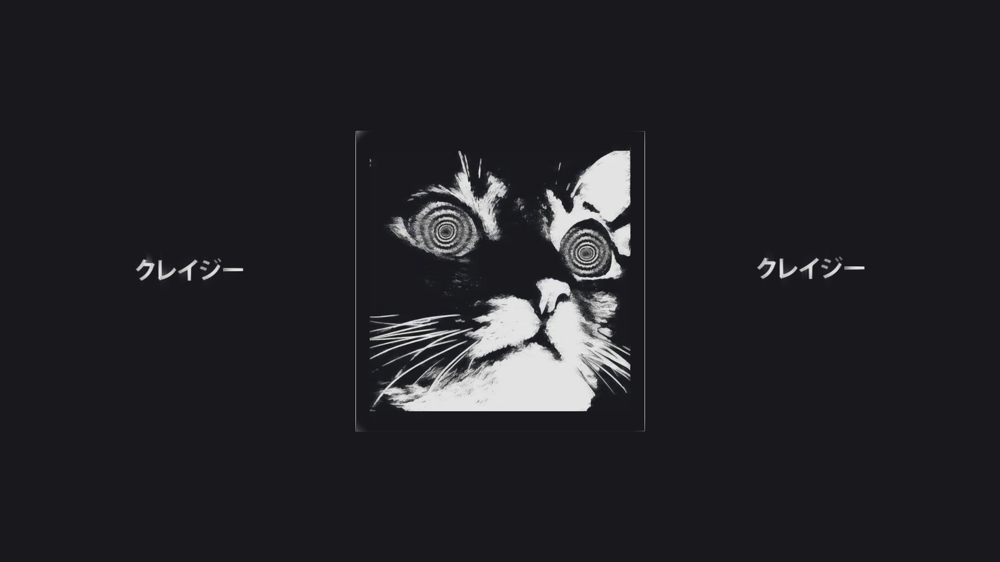
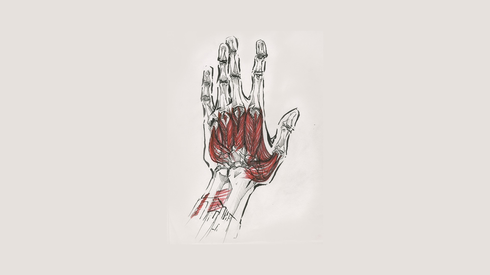
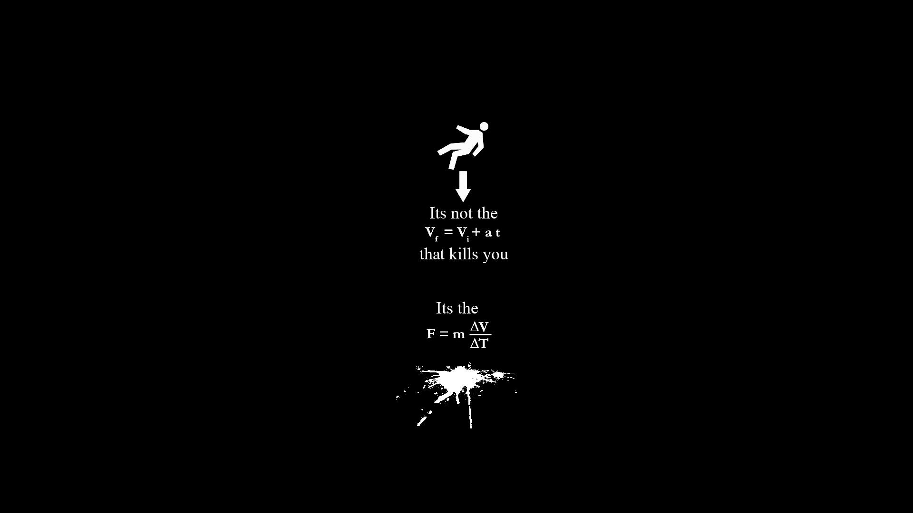
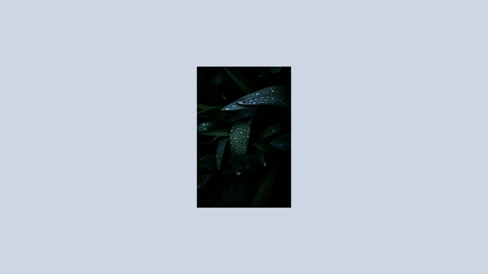
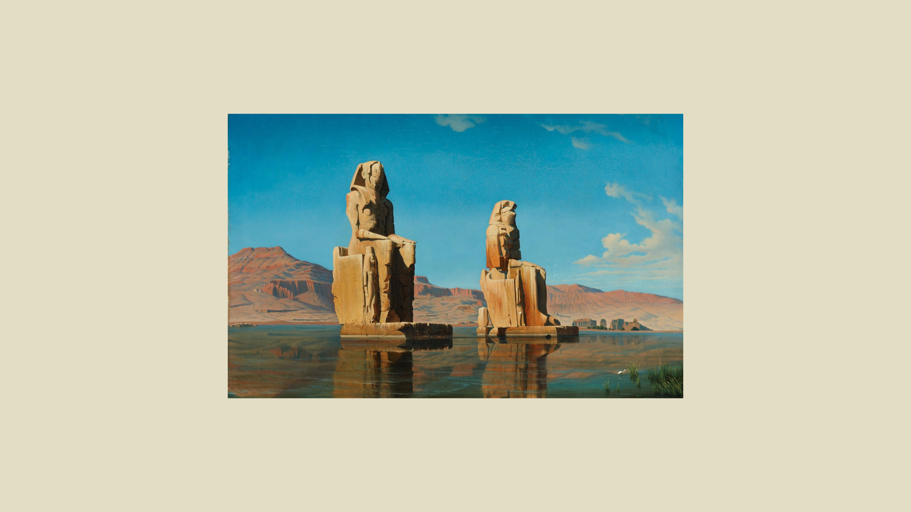

# CENTERED

<a href="009be5cf7148467dd44503b69e14231a.jpg"></a>

<details>

<summary>EXIFTOOL OUTPUT</summary>

```text
ExifTool Version Number         : 12.54
File Name                       : 009be5cf7148467dd44503b69e14231a.jpg
Directory                       : .
File Size                       : 75 kB
File Modification Date/Time     : 2023:01:12 17:21:50+05:30
File Access Date/Time           : 2023:04:13 23:47:39+05:30
File Inode Change Date/Time     : 2023:01:12 17:21:50+05:30
File Permissions                : -rw-r--r--
File Type                       : JPEG
File Type Extension             : jpg
MIME Type                       : image/jpeg
JFIF Version                    : 1.01
Resolution Unit                 : inches
X Resolution                    : 72
Y Resolution                    : 72
Image Width                     : 1920
Image Height                    : 1080
Encoding Process                : Baseline DCT, Huffman coding
Bits Per Sample                 : 8
Color Components                : 3
Y Cb Cr Sub Sampling            : YCbCr4:2:0 (2 2)
Image Size                      : 1920x1080
Megapixels                      : 2.1
```

</details>

<a href="08643900020d92b75d51bf3c84c641e3.jpg"></a>

<details>

<summary>EXIFTOOL OUTPUT</summary>

```text
ExifTool Version Number         : 12.54
File Name                       : 08643900020d92b75d51bf3c84c641e3.jpg
Directory                       : .
File Size                       : 112 kB
File Modification Date/Time     : 2023:01:12 17:21:50+05:30
File Access Date/Time           : 2023:04:13 23:47:39+05:30
File Inode Change Date/Time     : 2023:01:12 17:21:50+05:30
File Permissions                : -rw-r--r--
File Type                       : JPEG
File Type Extension             : jpg
MIME Type                       : image/jpeg
JFIF Version                    : 1.01
Resolution Unit                 : cm
X Resolution                    : 118
Y Resolution                    : 118
Profile CMM Type                : Adobe Systems Inc.
Profile Version                 : 2.1.0
Profile Class                   : Display Device Profile
Color Space Data                : RGB
Profile Connection Space        : XYZ
Profile Date Time               : 1999:06:03 00:00:00
Profile File Signature          : acsp
Primary Platform                : Apple Computer Inc.
CMM Flags                       : Not Embedded, Independent
Device Manufacturer             : none
Device Model                    : 
Device Attributes               : Reflective, Glossy, Positive, Color
Rendering Intent                : Perceptual
Connection Space Illuminant     : 0.9642 1 0.82491
Profile Creator                 : Adobe Systems Inc.
Profile ID                      : 0
Profile Copyright               : Copyright 1999 Adobe Systems Incorporated
Profile Description             : Adobe RGB (1998)
Media White Point               : 0.95045 1 1.08905
Media Black Point               : 0 0 0
Red Tone Reproduction Curve     : (Binary data 14 bytes, use -b option to extract)
Green Tone Reproduction Curve   : (Binary data 14 bytes, use -b option to extract)
Blue Tone Reproduction Curve    : (Binary data 14 bytes, use -b option to extract)
Red Matrix Column               : 0.60974 0.31111 0.01947
Green Matrix Column             : 0.20528 0.62567 0.06087
Blue Matrix Column              : 0.14919 0.06322 0.74457
Image Width                     : 1920
Image Height                    : 1080
Encoding Process                : Baseline DCT, Huffman coding
Bits Per Sample                 : 8
Color Components                : 3
Y Cb Cr Sub Sampling            : YCbCr4:4:4 (1 1)
Image Size                      : 1920x1080
Megapixels                      : 2.1
```

</details>

<a href="0fd979f8891feab2ce0ad52a97294eb2.jpg"></a>

<details>

<summary>EXIFTOOL OUTPUT</summary>

```text
ExifTool Version Number         : 12.54
File Name                       : 0fd979f8891feab2ce0ad52a97294eb2.jpg
Directory                       : .
File Size                       : 40 kB
File Modification Date/Time     : 2023:01:12 17:21:50+05:30
File Access Date/Time           : 2023:04:13 23:47:39+05:30
File Inode Change Date/Time     : 2023:01:12 17:21:50+05:30
File Permissions                : -rw-r--r--
File Type                       : JPEG
File Type Extension             : jpg
MIME Type                       : image/jpeg
Exif Byte Order                 : Big-endian (Motorola, MM)
Image Width                     : 497
Image Height                    : 497
Encoding Process                : Baseline DCT, Huffman coding
Bits Per Sample                 : 8
Color Components                : 3
Y Cb Cr Sub Sampling            : YCbCr4:2:0 (2 2)
Image Size                      : 497x497
Megapixels                      : 0.247
```

</details>

<a href="0vvgy8z8k8b91.jpg"></a>

<details>

<summary>EXIFTOOL OUTPUT</summary>

```text
ExifTool Version Number         : 12.54
File Name                       : 0vvgy8z8k8b91.jpg
Directory                       : .
File Size                       : 486 kB
File Modification Date/Time     : 2023:01:12 17:21:50+05:30
File Access Date/Time           : 2023:04:13 23:47:39+05:30
File Inode Change Date/Time     : 2023:01:12 17:21:50+05:30
File Permissions                : -rw-r--r--
File Type                       : JPEG
File Type Extension             : jpg
MIME Type                       : image/jpeg
JFIF Version                    : 1.01
Resolution Unit                 : None
X Resolution                    : 1
Y Resolution                    : 1
Profile CMM Type                : 
Profile Version                 : 2.1.0
Profile Class                   : Display Device Profile
Color Space Data                : RGB
Profile Connection Space        : XYZ
Profile Date Time               : 0000:00:00 00:00:00
Profile File Signature          : acsp
Primary Platform                : Unknown ()
CMM Flags                       : Not Embedded, Independent
Device Manufacturer             : 
Device Model                    : 
Device Attributes               : Reflective, Glossy, Positive, Color
Rendering Intent                : Media-Relative Colorimetric
Connection Space Illuminant     : 0.9642 1 0.82491
Profile Creator                 : 
Profile ID                      : 0
Profile Description             : sRGB
Red Matrix Column               : 0.43607 0.22249 0.01392
Green Matrix Column             : 0.38515 0.71687 0.09708
Blue Matrix Column              : 0.14307 0.06061 0.7141
Red Tone Reproduction Curve     : (Binary data 40 bytes, use -b option to extract)
Green Tone Reproduction Curve   : (Binary data 40 bytes, use -b option to extract)
Blue Tone Reproduction Curve    : (Binary data 40 bytes, use -b option to extract)
Media White Point               : 0.9642 1 0.82491
Profile Copyright               : Google Inc. 2016
Image Width                     : 3464
Image Height                    : 3464
Encoding Process                : Baseline DCT, Huffman coding
Bits Per Sample                 : 8
Color Components                : 3
Y Cb Cr Sub Sampling            : YCbCr4:2:0 (2 2)
Image Size                      : 3464x3464
Megapixels                      : 12.0
```

</details>

<a href="102502cccb5151369534f80b1007d728.jpg"></a>

<details>

<summary>EXIFTOOL OUTPUT</summary>

```text
ExifTool Version Number         : 12.54
File Name                       : 102502cccb5151369534f80b1007d728.jpg
Directory                       : .
File Size                       : 51 kB
File Modification Date/Time     : 2023:01:12 17:21:50+05:30
File Access Date/Time           : 2023:04:13 23:47:40+05:30
File Inode Change Date/Time     : 2023:01:12 17:21:50+05:30
File Permissions                : -rw-r--r--
File Type                       : JPEG
File Type Extension             : jpg
MIME Type                       : image/jpeg
JFIF Version                    : 1.01
Resolution Unit                 : None
X Resolution                    : 1
Y Resolution                    : 1
Image Width                     : 1920
Image Height                    : 1080
Encoding Process                : Baseline DCT, Huffman coding
Bits Per Sample                 : 8
Color Components                : 3
Y Cb Cr Sub Sampling            : YCbCr4:2:0 (2 2)
Image Size                      : 1920x1080
Megapixels                      : 2.1
```

</details>

<a href="120 - KnFPX73.jpg"></a>

<details>

<summary>EXIFTOOL OUTPUT</summary>

```text
ExifTool Version Number         : 12.54
File Name                       : 120 - KnFPX73.jpg
Directory                       : .
File Size                       : 758 kB
File Modification Date/Time     : 2023:01:12 17:21:50+05:30
File Access Date/Time           : 2023:04:13 23:47:40+05:30
File Inode Change Date/Time     : 2023:01:12 17:21:50+05:30
File Permissions                : -rw-r--r--
File Type                       : JPEG
File Type Extension             : jpg
MIME Type                       : image/jpeg
Image Width                     : 3792
Image Height                    : 2132
Encoding Process                : Baseline DCT, Huffman coding
Bits Per Sample                 : 8
Color Components                : 3
Y Cb Cr Sub Sampling            : YCbCr4:2:0 (2 2)
Image Size                      : 3792x2132
Megapixels                      : 8.1
```

</details>

<a href="2ba04db0622436aad503e3a4f507e5f5.jpg"></a>

<details>

<summary>EXIFTOOL OUTPUT</summary>

```text
ExifTool Version Number         : 12.54
File Name                       : 2ba04db0622436aad503e3a4f507e5f5.jpg
Directory                       : .
File Size                       : 57 kB
File Modification Date/Time     : 2023:01:12 17:21:50+05:30
File Access Date/Time           : 2023:04:13 23:47:40+05:30
File Inode Change Date/Time     : 2023:01:12 17:21:50+05:30
File Permissions                : -rw-r--r--
File Type                       : JPEG
File Type Extension             : jpg
MIME Type                       : image/jpeg
JFIF Version                    : 1.01
Resolution Unit                 : cm
X Resolution                    : 37
Y Resolution                    : 37
Image Width                     : 1600
Image Height                    : 900
Encoding Process                : Baseline DCT, Huffman coding
Bits Per Sample                 : 8
Color Components                : 3
Y Cb Cr Sub Sampling            : YCbCr4:4:4 (1 1)
Image Size                      : 1600x900
Megapixels                      : 1.4
```

</details>

<a href="2f54c492e53b215bc275e3dec33408b1.jpg"></a>

<details>

<summary>EXIFTOOL OUTPUT</summary>

```text
ExifTool Version Number         : 12.54
File Name                       : 2f54c492e53b215bc275e3dec33408b1.jpg
Directory                       : .
File Size                       : 23 kB
File Modification Date/Time     : 2023:01:12 17:21:50+05:30
File Access Date/Time           : 2023:04:13 23:47:40+05:30
File Inode Change Date/Time     : 2023:01:12 17:21:50+05:30
File Permissions                : -rw-r--r--
File Type                       : JPEG
File Type Extension             : jpg
MIME Type                       : image/jpeg
Exif Byte Order                 : Big-endian (Motorola, MM)
Image Width                     : 540
Image Height                    : 635
Encoding Process                : Baseline DCT, Huffman coding
Bits Per Sample                 : 8
Color Components                : 3
Y Cb Cr Sub Sampling            : YCbCr4:2:0 (2 2)
Image Size                      : 540x635
Megapixels                      : 0.343
```

</details>

<a href="3a8158nxy9to.png"></a>

<details>

<summary>EXIFTOOL OUTPUT</summary>

```text
ExifTool Version Number         : 12.54
File Name                       : 3a8158nxy9to.png
Directory                       : .
File Size                       : 103 kB
File Modification Date/Time     : 2023:01:12 17:21:50+05:30
File Access Date/Time           : 2023:04:13 23:47:40+05:30
File Inode Change Date/Time     : 2023:01:12 17:21:50+05:30
File Permissions                : -rw-r--r--
File Type                       : PNG
File Type Extension             : png
MIME Type                       : image/png
Image Width                     : 1920
Image Height                    : 1080
Bit Depth                       : 4
Color Type                      : Palette
Compression                     : Deflate/Inflate
Filter                          : Adaptive
Interlace                       : Noninterlaced
Palette                         : (Binary data 45 bytes, use -b option to extract)
Image Size                      : 1920x1080
Megapixels                      : 2.1
```

</details>

<a href="4a45b9f6a6f7c856356295af6bdad496.jpg"></a>

<details>

<summary>EXIFTOOL OUTPUT</summary>

```text
ExifTool Version Number         : 12.54
File Name                       : 4a45b9f6a6f7c856356295af6bdad496.jpg
Directory                       : .
File Size                       : 284 kB
File Modification Date/Time     : 2023:01:12 17:21:50+05:30
File Access Date/Time           : 2023:04:13 23:47:40+05:30
File Inode Change Date/Time     : 2023:01:12 17:21:50+05:30
File Permissions                : -rw-r--r--
File Type                       : JPEG
File Type Extension             : jpg
MIME Type                       : image/jpeg
JFIF Version                    : 1.01
Resolution Unit                 : inches
X Resolution                    : 96
Y Resolution                    : 96
Image Width                     : 1920
Image Height                    : 1080
Encoding Process                : Baseline DCT, Huffman coding
Bits Per Sample                 : 8
Color Components                : 3
Y Cb Cr Sub Sampling            : YCbCr4:2:0 (2 2)
Image Size                      : 1920x1080
Megapixels                      : 2.1
```

</details>

<a href="54286b774379ba7351ddac69d9e3dc93.jpg"></a>

<details>

<summary>EXIFTOOL OUTPUT</summary>

```text
ExifTool Version Number         : 12.54
File Name                       : 54286b774379ba7351ddac69d9e3dc93.jpg
Directory                       : .
File Size                       : 72 kB
File Modification Date/Time     : 2023:01:12 17:21:50+05:30
File Access Date/Time           : 2023:04:13 23:47:40+05:30
File Inode Change Date/Time     : 2023:01:12 17:21:50+05:30
File Permissions                : -rw-r--r--
File Type                       : JPEG
File Type Extension             : jpg
MIME Type                       : image/jpeg
JFIF Version                    : 1.01
Resolution Unit                 : None
X Resolution                    : 1
Y Resolution                    : 1
Image Width                     : 1920
Image Height                    : 1080
Encoding Process                : Baseline DCT, Huffman coding
Bits Per Sample                 : 8
Color Components                : 3
Y Cb Cr Sub Sampling            : YCbCr4:2:0 (2 2)
Image Size                      : 1920x1080
Megapixels                      : 2.1
```

</details>

<a href="57095abfb28b52d0fba246e075feca46.jpg"></a>

<details>

<summary>EXIFTOOL OUTPUT</summary>

```text
ExifTool Version Number         : 12.54
File Name                       : 57095abfb28b52d0fba246e075feca46.jpg
Directory                       : .
File Size                       : 37 kB
File Modification Date/Time     : 2023:01:12 17:21:50+05:30
File Access Date/Time           : 2023:04:13 23:47:40+05:30
File Inode Change Date/Time     : 2023:01:12 17:21:50+05:30
File Permissions                : -rw-r--r--
File Type                       : JPEG
File Type Extension             : jpg
MIME Type                       : image/jpeg
JFIF Version                    : 1.01
Resolution Unit                 : cm
X Resolution                    : 118
Y Resolution                    : 118
Profile CMM Type                : Little CMS
Profile Version                 : 4.3.0
Profile Class                   : Display Device Profile
Color Space Data                : RGB
Profile Connection Space        : XYZ
Profile Date Time               : 2021:07:23 16:36:17
Profile File Signature          : acsp
Primary Platform                : Apple Computer Inc.
CMM Flags                       : Not Embedded, Independent
Device Manufacturer             : 
Device Model                    : 
Device Attributes               : Reflective, Glossy, Positive, Color
Rendering Intent                : Perceptual
Connection Space Illuminant     : 0.9642 1 0.82491
Profile Creator                 : Little CMS
Profile ID                      : 0
Profile Description             : GIMP built-in sRGB
Profile Copyright               : Public Domain
Media White Point               : 0.9642 1 0.82491
Chromatic Adaptation            : 1.04788 0.02292 -0.05022 0.02959 0.99048 -0.01707 -0.00925 0.01508 0.75168
Red Matrix Column               : 0.43604 0.22249 0.01392
Blue Matrix Column              : 0.14305 0.06061 0.71393
Green Matrix Column             : 0.38512 0.7169 0.09706
Red Tone Reproduction Curve     : (Binary data 32 bytes, use -b option to extract)
Green Tone Reproduction Curve   : (Binary data 32 bytes, use -b option to extract)
Blue Tone Reproduction Curve    : (Binary data 32 bytes, use -b option to extract)
Chromaticity Channels           : 3
Chromaticity Colorant           : Unknown
Chromaticity Channel 1          : 0.64 0.33002
Chromaticity Channel 2          : 0.3 0.60001
Chromaticity Channel 3          : 0.15001 0.06
Device Mfg Desc                 : GIMP
Device Model Desc               : sRGB
Image Width                     : 1920
Image Height                    : 1080
Encoding Process                : Baseline DCT, Huffman coding
Bits Per Sample                 : 8
Color Components                : 3
Y Cb Cr Sub Sampling            : YCbCr4:4:4 (1 1)
Image Size                      : 1920x1080
Megapixels                      : 2.1
```

</details>

<a href="6561dfc22ae0bcce01e8e4dbcc801015.jpg"></a>

<details>

<summary>EXIFTOOL OUTPUT</summary>

```text
ExifTool Version Number         : 12.54
File Name                       : 6561dfc22ae0bcce01e8e4dbcc801015.jpg
Directory                       : .
File Size                       : 320 kB
File Modification Date/Time     : 2023:01:12 17:21:50+05:30
File Access Date/Time           : 2023:04:13 23:47:40+05:30
File Inode Change Date/Time     : 2023:01:12 17:21:50+05:30
File Permissions                : -rw-r--r--
File Type                       : JPEG
File Type Extension             : jpg
MIME Type                       : image/jpeg
JFIF Version                    : 1.01
Resolution Unit                 : inches
X Resolution                    : 96
Y Resolution                    : 96
Image Width                     : 1920
Image Height                    : 1080
Encoding Process                : Baseline DCT, Huffman coding
Bits Per Sample                 : 8
Color Components                : 3
Y Cb Cr Sub Sampling            : YCbCr4:2:0 (2 2)
Image Size                      : 1920x1080
Megapixels                      : 2.1
```

</details>

<a href="6f0ksV9.jpeg"></a>

<details>

<summary>EXIFTOOL OUTPUT</summary>

```text
ExifTool Version Number         : 12.54
File Name                       : 6f0ksV9.jpeg
Directory                       : .
File Size                       : 622 kB
File Modification Date/Time     : 2023:01:12 17:21:50+05:30
File Access Date/Time           : 2023:04:13 23:47:40+05:30
File Inode Change Date/Time     : 2023:01:12 17:21:50+05:30
File Permissions                : -rw-r--r--
File Type                       : JPEG
File Type Extension             : jpg
MIME Type                       : image/jpeg
Image Width                     : 4000
Image Height                    : 2400
Encoding Process                : Baseline DCT, Huffman coding
Bits Per Sample                 : 8
Color Components                : 3
Y Cb Cr Sub Sampling            : YCbCr4:2:0 (2 2)
Image Size                      : 4000x2400
Megapixels                      : 9.6
```

</details>

<a href="7731329aaa3ff2759aab7d4fed97e333.jpg"></a>

<details>

<summary>EXIFTOOL OUTPUT</summary>

```text
ExifTool Version Number         : 12.54
File Name                       : 7731329aaa3ff2759aab7d4fed97e333.jpg
Directory                       : .
File Size                       : 34 kB
File Modification Date/Time     : 2023:01:12 17:21:50+05:30
File Access Date/Time           : 2023:04:13 23:47:40+05:30
File Inode Change Date/Time     : 2023:01:12 17:21:50+05:30
File Permissions                : -rw-r--r--
File Type                       : JPEG
File Type Extension             : jpg
MIME Type                       : image/jpeg
Exif Byte Order                 : Big-endian (Motorola, MM)
Image Width                     : 480
Image Height                    : 730
Encoding Process                : Baseline DCT, Huffman coding
Bits Per Sample                 : 8
Color Components                : 3
Y Cb Cr Sub Sampling            : YCbCr4:2:0 (2 2)
Image Size                      : 480x730
Megapixels                      : 0.350
```

</details>

<a href="7880029d5069f2b7299187ffbb1dc7fb.jpg"></a>

<details>

<summary>EXIFTOOL OUTPUT</summary>

```text
ExifTool Version Number         : 12.54
File Name                       : 7880029d5069f2b7299187ffbb1dc7fb.jpg
Directory                       : .
File Size                       : 50 kB
File Modification Date/Time     : 2023:01:12 17:21:50+05:30
File Access Date/Time           : 2023:04:13 23:47:40+05:30
File Inode Change Date/Time     : 2023:01:12 17:21:50+05:30
File Permissions                : -rw-r--r--
File Type                       : JPEG
File Type Extension             : jpg
MIME Type                       : image/jpeg
JFIF Version                    : 1.01
Resolution Unit                 : inches
X Resolution                    : 96
Y Resolution                    : 96
Image Width                     : 1920
Image Height                    : 1080
Encoding Process                : Baseline DCT, Huffman coding
Bits Per Sample                 : 8
Color Components                : 3
Y Cb Cr Sub Sampling            : YCbCr4:2:0 (2 2)
Image Size                      : 1920x1080
Megapixels                      : 2.1
```

</details>

<a href="7dbkx11dyo591.png"></a>

<details>

<summary>EXIFTOOL OUTPUT</summary>

```text
ExifTool Version Number         : 12.54
File Name                       : 7dbkx11dyo591.png
Directory                       : .
File Size                       : 396 kB
File Modification Date/Time     : 2023:01:12 17:21:50+05:30
File Access Date/Time           : 2023:04:13 23:47:40+05:30
File Inode Change Date/Time     : 2023:01:12 17:21:50+05:30
File Permissions                : -rw-r--r--
File Type                       : PNG
File Type Extension             : png
MIME Type                       : image/png
Image Width                     : 1920
Image Height                    : 1080
Bit Depth                       : 8
Color Type                      : RGB
Compression                     : Deflate/Inflate
Filter                          : Adaptive
Interlace                       : Noninterlaced
Image Size                      : 1920x1080
Megapixels                      : 2.1
```

</details>

<a href="89 - PLNr7AT.png"></a>

<details>

<summary>EXIFTOOL OUTPUT</summary>

```text
ExifTool Version Number         : 12.54
File Name                       : 89 - PLNr7AT.png
Directory                       : .
File Size                       : 2.2 MB
File Modification Date/Time     : 2023:01:12 17:21:50+05:30
File Access Date/Time           : 2023:04:13 23:47:41+05:30
File Inode Change Date/Time     : 2023:01:12 17:21:50+05:30
File Permissions                : -rw-r--r--
File Type                       : PNG
File Type Extension             : png
MIME Type                       : image/png
Image Width                     : 1920
Image Height                    : 1080
Bit Depth                       : 8
Color Type                      : RGB with Alpha
Compression                     : Deflate/Inflate
Filter                          : Adaptive
Interlace                       : Noninterlaced
Image Size                      : 1920x1080
Megapixels                      : 2.1
```

</details>

<a href="8b5e5f53d9e51099109284fad52bc431.jpg"></a>

<details>

<summary>EXIFTOOL OUTPUT</summary>

```text
ExifTool Version Number         : 12.54
File Name                       : 8b5e5f53d9e51099109284fad52bc431.jpg
Directory                       : .
File Size                       : 34 kB
File Modification Date/Time     : 2023:01:12 17:21:50+05:30
File Access Date/Time           : 2023:04:13 23:47:41+05:30
File Inode Change Date/Time     : 2023:01:12 17:21:50+05:30
File Permissions                : -rw-r--r--
File Type                       : JPEG
File Type Extension             : jpg
MIME Type                       : image/jpeg
Exif Byte Order                 : Big-endian (Motorola, MM)
Image Width                     : 640
Image Height                    : 640
Encoding Process                : Baseline DCT, Huffman coding
Bits Per Sample                 : 8
Color Components                : 3
Y Cb Cr Sub Sampling            : YCbCr4:2:0 (2 2)
Image Size                      : 640x640
Megapixels                      : 0.410
```

</details>

<a href="90380165462ec0ffaf29ba64472fcebf.jpg"></a>

<details>

<summary>EXIFTOOL OUTPUT</summary>

```text
ExifTool Version Number         : 12.54
File Name                       : 90380165462ec0ffaf29ba64472fcebf.jpg
Directory                       : .
File Size                       : 26 kB
File Modification Date/Time     : 2023:01:12 17:21:50+05:30
File Access Date/Time           : 2023:04:13 23:47:41+05:30
File Inode Change Date/Time     : 2023:01:12 17:21:50+05:30
File Permissions                : -rw-r--r--
File Type                       : JPEG
File Type Extension             : jpg
MIME Type                       : image/jpeg
Exif Byte Order                 : Big-endian (Motorola, MM)
Image Width                     : 500
Image Height                    : 491
Encoding Process                : Baseline DCT, Huffman coding
Bits Per Sample                 : 8
Color Components                : 3
Y Cb Cr Sub Sampling            : YCbCr4:2:0 (2 2)
Image Size                      : 500x491
Megapixels                      : 0.245
```

</details>

<a href="98 - BU5WdYL.jpg"></a>

<details>

<summary>EXIFTOOL OUTPUT</summary>

```text
ExifTool Version Number         : 12.54
File Name                       : 98 - BU5WdYL.jpg
Directory                       : .
File Size                       : 2.2 MB
File Modification Date/Time     : 2023:01:12 17:21:50+05:30
File Access Date/Time           : 2023:04:13 23:47:41+05:30
File Inode Change Date/Time     : 2023:01:12 17:21:50+05:30
File Permissions                : -rw-r--r--
File Type                       : JPEG
File Type Extension             : jpg
MIME Type                       : image/jpeg
Image Width                     : 5364
Image Height                    : 3017
Encoding Process                : Baseline DCT, Huffman coding
Bits Per Sample                 : 8
Color Components                : 3
Y Cb Cr Sub Sampling            : YCbCr4:4:4 (1 1)
Image Size                      : 5364x3017
Megapixels                      : 16.2
```

</details>

<a href="a7cd88558270ec80c55a4732390f3539.jpg"></a>

<details>

<summary>EXIFTOOL OUTPUT</summary>

```text
ExifTool Version Number         : 12.54
File Name                       : a7cd88558270ec80c55a4732390f3539.jpg
Directory                       : .
File Size                       : 81 kB
File Modification Date/Time     : 2023:01:12 17:21:50+05:30
File Access Date/Time           : 2023:04:13 23:47:41+05:30
File Inode Change Date/Time     : 2023:01:12 17:21:50+05:30
File Permissions                : -rw-r--r--
File Type                       : JPEG
File Type Extension             : jpg
MIME Type                       : image/jpeg
Exif Byte Order                 : Big-endian (Motorola, MM)
Image Width                     : 659
Image Height                    : 923
Encoding Process                : Baseline DCT, Huffman coding
Bits Per Sample                 : 8
Color Components                : 3
Y Cb Cr Sub Sampling            : YCbCr4:2:0 (2 2)
Image Size                      : 659x923
Megapixels                      : 0.608
```

</details>

<a href="a833fa24762f669fb518c520acdaabb9.jpg"></a>

<details>

<summary>EXIFTOOL OUTPUT</summary>

```text
ExifTool Version Number         : 12.54
File Name                       : a833fa24762f669fb518c520acdaabb9.jpg
Directory                       : .
File Size                       : 12 kB
File Modification Date/Time     : 2023:01:12 17:21:50+05:30
File Access Date/Time           : 2023:04:13 23:47:41+05:30
File Inode Change Date/Time     : 2023:01:12 17:21:50+05:30
File Permissions                : -rw-r--r--
File Type                       : JPEG
File Type Extension             : jpg
MIME Type                       : image/jpeg
JFIF Version                    : 1.01
Resolution Unit                 : cm
X Resolution                    : 37
Y Resolution                    : 37
Image Width                     : 1920
Image Height                    : 1080
Encoding Process                : Baseline DCT, Huffman coding
Bits Per Sample                 : 8
Color Components                : 1
Image Size                      : 1920x1080
Megapixels                      : 2.1
```

</details>

<a href="ae8279bc944616957f7d2c8e01bef6ba.jpg"></a>

<details>

<summary>EXIFTOOL OUTPUT</summary>

```text
ExifTool Version Number         : 12.54
File Name                       : ae8279bc944616957f7d2c8e01bef6ba.jpg
Directory                       : .
File Size                       : 174 kB
File Modification Date/Time     : 2023:01:12 17:21:50+05:30
File Access Date/Time           : 2023:04:13 23:47:41+05:30
File Inode Change Date/Time     : 2023:01:12 17:21:50+05:30
File Permissions                : -rw-r--r--
File Type                       : JPEG
File Type Extension             : jpg
MIME Type                       : image/jpeg
JFIF Version                    : 1.01
Resolution Unit                 : None
X Resolution                    : 1
Y Resolution                    : 1
Image Width                     : 1920
Image Height                    : 1080
Encoding Process                : Baseline DCT, Huffman coding
Bits Per Sample                 : 8
Color Components                : 3
Y Cb Cr Sub Sampling            : YCbCr4:4:4 (1 1)
Image Size                      : 1920x1080
Megapixels                      : 2.1
```

</details>

<a href="c824736e45a798eacecc930d370c442a.jpg"></a>

<details>

<summary>EXIFTOOL OUTPUT</summary>

```text
ExifTool Version Number         : 12.54
File Name                       : c824736e45a798eacecc930d370c442a.jpg
Directory                       : .
File Size                       : 130 kB
File Modification Date/Time     : 2023:01:12 17:21:50+05:30
File Access Date/Time           : 2023:04:13 23:47:41+05:30
File Inode Change Date/Time     : 2023:01:12 17:21:50+05:30
File Permissions                : -rw-r--r--
File Type                       : JPEG
File Type Extension             : jpg
MIME Type                       : image/jpeg
JFIF Version                    : 1.01
Resolution Unit                 : None
X Resolution                    : 1
Y Resolution                    : 1
Image Width                     : 1920
Image Height                    : 1080
Encoding Process                : Baseline DCT, Huffman coding
Bits Per Sample                 : 8
Color Components                : 1
Image Size                      : 1920x1080
Megapixels                      : 2.1
```

</details>

<a href="c8438fb8efcb744f467a0c9190c05d68.jpg"></a>

<details>

<summary>EXIFTOOL OUTPUT</summary>

```text
ExifTool Version Number         : 12.54
File Name                       : c8438fb8efcb744f467a0c9190c05d68.jpg
Directory                       : .
File Size                       : 117 kB
File Modification Date/Time     : 2023:01:12 17:21:50+05:30
File Access Date/Time           : 2023:04:13 23:47:41+05:30
File Inode Change Date/Time     : 2023:01:12 17:21:50+05:30
File Permissions                : -rw-r--r--
File Type                       : JPEG
File Type Extension             : jpg
MIME Type                       : image/jpeg
Exif Byte Order                 : Big-endian (Motorola, MM)
Image Width                     : 720
Image Height                    : 1280
Encoding Process                : Baseline DCT, Huffman coding
Bits Per Sample                 : 8
Color Components                : 3
Y Cb Cr Sub Sampling            : YCbCr4:2:0 (2 2)
Image Size                      : 720x1280
Megapixels                      : 0.922
```

</details>

<a href="d0ecfd1f98d9e67bb2766fa3e4c02aa8.jpg"></a>

<details>

<summary>EXIFTOOL OUTPUT</summary>

```text
ExifTool Version Number         : 12.54
File Name                       : d0ecfd1f98d9e67bb2766fa3e4c02aa8.jpg
Directory                       : .
File Size                       : 56 kB
File Modification Date/Time     : 2023:01:12 17:21:50+05:30
File Access Date/Time           : 2023:04:13 23:47:42+05:30
File Inode Change Date/Time     : 2023:01:12 17:21:50+05:30
File Permissions                : -rw-r--r--
File Type                       : JPEG
File Type Extension             : jpg
MIME Type                       : image/jpeg
JFIF Version                    : 1.01
Resolution Unit                 : None
X Resolution                    : 1
Y Resolution                    : 1
Image Width                     : 1500
Image Height                    : 1000
Encoding Process                : Baseline DCT, Huffman coding
Bits Per Sample                 : 8
Color Components                : 3
Y Cb Cr Sub Sampling            : YCbCr4:4:4 (1 1)
Image Size                      : 1500x1000
Megapixels                      : 1.5
```

</details>

<a href="d69a0015a98ec4d773cbb93c53289753.jpg"></a>

<details>

<summary>EXIFTOOL OUTPUT</summary>

```text
ExifTool Version Number         : 12.54
File Name                       : d69a0015a98ec4d773cbb93c53289753.jpg
Directory                       : .
File Size                       : 38 kB
File Modification Date/Time     : 2023:01:12 17:21:50+05:30
File Access Date/Time           : 2023:04:13 23:47:42+05:30
File Inode Change Date/Time     : 2023:01:12 17:21:50+05:30
File Permissions                : -rw-r--r--
File Type                       : JPEG
File Type Extension             : jpg
MIME Type                       : image/jpeg
Exif Byte Order                 : Big-endian (Motorola, MM)
Image Width                     : 720
Image Height                    : 1280
Encoding Process                : Baseline DCT, Huffman coding
Bits Per Sample                 : 8
Color Components                : 3
Y Cb Cr Sub Sampling            : YCbCr4:2:0 (2 2)
Image Size                      : 720x1280
Megapixels                      : 0.922
```

</details>

<a href="da14a00f4cf6294c351ef473c3787d77.jpg"></a>

<details>

<summary>EXIFTOOL OUTPUT</summary>

```text
ExifTool Version Number         : 12.54
File Name                       : da14a00f4cf6294c351ef473c3787d77.jpg
Directory                       : .
File Size                       : 72 kB
File Modification Date/Time     : 2023:01:12 17:21:50+05:30
File Access Date/Time           : 2023:04:13 23:47:42+05:30
File Inode Change Date/Time     : 2023:01:12 17:21:50+05:30
File Permissions                : -rw-r--r--
File Type                       : JPEG
File Type Extension             : jpg
MIME Type                       : image/jpeg
JFIF Version                    : 1.01
Resolution Unit                 : cm
X Resolution                    : 28
Y Resolution                    : 28
Image Width                     : 1366
Image Height                    : 768
Encoding Process                : Baseline DCT, Huffman coding
Bits Per Sample                 : 8
Color Components                : 3
Y Cb Cr Sub Sampling            : YCbCr4:4:4 (1 1)
Image Size                      : 1366x768
Megapixels                      : 1.0
```

</details>

<a href="dac50a3d732f97b4c91497f4e9f7046c.jpg"></a>

<details>

<summary>EXIFTOOL OUTPUT</summary>

```text
ExifTool Version Number         : 12.54
File Name                       : dac50a3d732f97b4c91497f4e9f7046c.jpg
Directory                       : .
File Size                       : 72 kB
File Modification Date/Time     : 2023:01:12 17:21:50+05:30
File Access Date/Time           : 2023:04:13 23:47:42+05:30
File Inode Change Date/Time     : 2023:01:12 17:21:50+05:30
File Permissions                : -rw-r--r--
File Type                       : JPEG
File Type Extension             : jpg
MIME Type                       : image/jpeg
JFIF Version                    : 1.01
Resolution Unit                 : inches
X Resolution                    : 96
Y Resolution                    : 96
Image Width                     : 1920
Image Height                    : 1080
Encoding Process                : Baseline DCT, Huffman coding
Bits Per Sample                 : 8
Color Components                : 3
Y Cb Cr Sub Sampling            : YCbCr4:2:0 (2 2)
Image Size                      : 1920x1080
Megapixels                      : 2.1
```

</details>

<a href="db83a9ba062c109b13e507c7da891e3c.jpg"></a>

<details>

<summary>EXIFTOOL OUTPUT</summary>

```text
ExifTool Version Number         : 12.54
File Name                       : db83a9ba062c109b13e507c7da891e3c.jpg
Directory                       : .
File Size                       : 20 kB
File Modification Date/Time     : 2023:01:12 17:21:50+05:30
File Access Date/Time           : 2023:04:13 23:47:42+05:30
File Inode Change Date/Time     : 2023:01:12 17:21:50+05:30
File Permissions                : -rw-r--r--
File Type                       : JPEG
File Type Extension             : jpg
MIME Type                       : image/jpeg
JFIF Version                    : 1.01
Resolution Unit                 : None
X Resolution                    : 72
Y Resolution                    : 72
Current IPTC Digest             : d41d8cd98f00b204e9800998ecf8427e
IPTC Digest                     : d41d8cd98f00b204e9800998ecf8427e
Exif Byte Order                 : Big-endian (Motorola, MM)
Exif Image Width                : 4330
Exif Image Height               : 2436
Profile CMM Type                : Apple Computer Inc.
Profile Version                 : 4.0.0
Profile Class                   : Display Device Profile
Color Space Data                : RGB
Profile Connection Space        : XYZ
Profile Date Time               : 2017:07:07 13:22:32
Profile File Signature          : acsp
Primary Platform                : Apple Computer Inc.
CMM Flags                       : Not Embedded, Independent
Device Manufacturer             : Apple Computer Inc.
Device Model                    : 
Device Attributes               : Reflective, Glossy, Positive, Color
Rendering Intent                : Perceptual
Connection Space Illuminant     : 0.9642 1 0.82491
Profile Creator                 : Apple Computer Inc.
Profile ID                      : ca1a9582257f104d389913d5d1ea1582
Profile Description             : Display P3
Profile Copyright               : Copyright Apple Inc., 2017
Media White Point               : 0.95045 1 1.08905
Red Matrix Column               : 0.51512 0.2412 -0.00105
Green Matrix Column             : 0.29198 0.69225 0.04189
Blue Matrix Column              : 0.1571 0.06657 0.78407
Red Tone Reproduction Curve     : (Binary data 32 bytes, use -b option to extract)
Chromatic Adaptation            : 1.04788 0.02292 -0.0502 0.02959 0.99048 -0.01706 -0.00923 0.01508 0.75168
Blue Tone Reproduction Curve    : (Binary data 32 bytes, use -b option to extract)
Green Tone Reproduction Curve   : (Binary data 32 bytes, use -b option to extract)
Image Width                     : 1920
Image Height                    : 1080
Encoding Process                : Baseline DCT, Huffman coding
Bits Per Sample                 : 8
Color Components                : 1
Image Size                      : 1920x1080
Megapixels                      : 2.1
```

</details>

<a href="Diseno_sin_titulo2.png"></a>

<details>

<summary>EXIFTOOL OUTPUT</summary>

```text
ExifTool Version Number         : 12.54
File Name                       : Diseno_sin_titulo2.png
Directory                       : .
File Size                       : 720 kB
File Modification Date/Time     : 2023:01:18 10:02:45+05:30
File Access Date/Time           : 2023:04:13 23:47:42+05:30
File Inode Change Date/Time     : 2023:01:18 11:44:37+05:30
File Permissions                : -rw-r--r--
File Type                       : PNG
File Type Extension             : png
MIME Type                       : image/png
Image Width                     : 1920
Image Height                    : 1080
Bit Depth                       : 8
Color Type                      : RGB with Alpha
Compression                     : Deflate/Inflate
Filter                          : Adaptive
Interlace                       : Noninterlaced
Pixels Per Unit X               : 3780
Pixels Per Unit Y               : 3780
Pixel Units                     : meters
Comment                         : xr:d:DAFXtzIQVOs:4,j:45219127661,t:23011507
Title                           : Diseño sin título - 1
Ads Created                     : 2023-01-15
Ads Ext Id                      : 9ba2e739-c9e6-4920-9924-a6095f4865bd
Ads Fb Id                       : 525265914179580
Ads Touch Type                  : 2
Author                          : Adrián Becerra
Creator Tool                    : Canva
Warning                         : [minor] Text/EXIF chunk(s) found after PNG IDAT (may be ignored by some readers)
Exif Byte Order                 : Big-endian (Motorola, MM)
Image Size                      : 1920x1080
Megapixels                      : 2.1
```

</details>

<a href="e2346ad7dab59fd328950429abde3bb5.jpg"></a>

<details>

<summary>EXIFTOOL OUTPUT</summary>

```text
ExifTool Version Number         : 12.54
File Name                       : e2346ad7dab59fd328950429abde3bb5.jpg
Directory                       : .
File Size                       : 106 kB
File Modification Date/Time     : 2023:01:12 17:21:50+05:30
File Access Date/Time           : 2023:04:13 23:47:42+05:30
File Inode Change Date/Time     : 2023:01:12 17:21:50+05:30
File Permissions                : -rw-r--r--
File Type                       : JPEG
File Type Extension             : jpg
MIME Type                       : image/jpeg
JFIF Version                    : 1.01
Resolution Unit                 : None
X Resolution                    : 1
Y Resolution                    : 1
Image Width                     : 1920
Image Height                    : 1080
Encoding Process                : Baseline DCT, Huffman coding
Bits Per Sample                 : 8
Color Components                : 3
Y Cb Cr Sub Sampling            : YCbCr4:4:4 (1 1)
Image Size                      : 1920x1080
Megapixels                      : 2.1
```

</details>

<a href="e8d6d4b9e38869a6cbfbac40a401c6a5.jpg"></a>

<details>

<summary>EXIFTOOL OUTPUT</summary>

```text
ExifTool Version Number         : 12.54
File Name                       : e8d6d4b9e38869a6cbfbac40a401c6a5.jpg
Directory                       : .
File Size                       : 216 kB
File Modification Date/Time     : 2023:01:12 17:21:50+05:30
File Access Date/Time           : 2023:04:13 23:47:42+05:30
File Inode Change Date/Time     : 2023:01:12 17:21:50+05:30
File Permissions                : -rw-r--r--
File Type                       : JPEG
File Type Extension             : jpg
MIME Type                       : image/jpeg
JFIF Version                    : 1.01
Comment                         : Created with GIMP
Exif Byte Order                 : Little-endian (Intel, II)
Image Description               : Created with GIMP
Orientation                     : Horizontal (normal)
X Resolution                    : 118
Y Resolution                    : 118
Resolution Unit                 : cm
Software                        : GIMP 2.10.22
Modify Date                     : 2021:01:26 14:26:33
User Comment                    : Created with GIMP
Color Space                     : sRGB
Compression                     : JPEG (old-style)
Photometric Interpretation      : YCbCr
Samples Per Pixel               : 3
Thumbnail Offset                : 435
Thumbnail Length                : 1897
Profile CMM Type                : Little CMS
Profile Version                 : 4.3.0
Profile Class                   : Display Device Profile
Color Space Data                : RGB
Profile Connection Space        : XYZ
Profile Date Time               : 2021:01:26 22:25:12
Profile File Signature          : acsp
Primary Platform                : Apple Computer Inc.
CMM Flags                       : Not Embedded, Independent
Device Manufacturer             : 
Device Model                    : 
Device Attributes               : Reflective, Glossy, Positive, Color
Rendering Intent                : Perceptual
Connection Space Illuminant     : 0.9642 1 0.82491
Profile Creator                 : Little CMS
Profile ID                      : 0
Profile Description             : GIMP built-in sRGB
Profile Copyright               : Public Domain
Media White Point               : 0.9642 1 0.82491
Chromatic Adaptation            : 1.04788 0.02292 -0.05022 0.02959 0.99048 -0.01707 -0.00925 0.01508 0.75168
Red Matrix Column               : 0.43604 0.22249 0.01392
Blue Matrix Column              : 0.14305 0.06061 0.71393
Green Matrix Column             : 0.38512 0.7169 0.09706
Red Tone Reproduction Curve     : (Binary data 32 bytes, use -b option to extract)
Green Tone Reproduction Curve   : (Binary data 32 bytes, use -b option to extract)
Blue Tone Reproduction Curve    : (Binary data 32 bytes, use -b option to extract)
Chromaticity Channels           : 3
Chromaticity Colorant           : Unknown
Chromaticity Channel 1          : 0.64 0.33002
Chromaticity Channel 2          : 0.3 0.60001
Chromaticity Channel 3          : 0.15001 0.06
Device Mfg Desc                 : GIMP
Device Model Desc               : sRGB
Image Width                     : 1920
Image Height                    : 1080
Encoding Process                : Baseline DCT, Huffman coding
Bits Per Sample                 : 8
Color Components                : 3
Y Cb Cr Sub Sampling            : YCbCr4:4:4 (1 1)
Image Size                      : 1920x1080
Megapixels                      : 2.1
Thumbnail Image                 : (Binary data 1897 bytes, use -b option to extract)
```

</details>

<a href="earth_internet_cable.jpg"></a>

<details>

<summary>EXIFTOOL OUTPUT</summary>

```text
ExifTool Version Number         : 12.54
File Name                       : earth_internet_cable.jpg
Directory                       : .
File Size                       : 70 kB
File Modification Date/Time     : 2023:01:12 17:21:50+05:30
File Access Date/Time           : 2023:04:13 23:47:42+05:30
File Inode Change Date/Time     : 2023:01:12 17:21:50+05:30
File Permissions                : -rw-r--r--
File Type                       : JPEG
File Type Extension             : jpg
MIME Type                       : image/jpeg
Exif Byte Order                 : Big-endian (Motorola, MM)
Orientation                     : Horizontal (normal)
XMP Toolkit                     : XMP Core 4.4.0-Exiv2
Document ID                     : gimp:docid:gimp:8fca1807-fc84-4a8c-8a7e-04e8c2f2f273
Instance ID                     : xmp.iid:479fd700-f25f-40aa-927f-9c0bafac5c1a
Original Document ID            : xmp.did:726e22e3-37b2-4257-a2f6-2a9a70e116a7
Api                             : 2.0
Platform                        : Linux
Time Stamp                      : 1658994047837855
Version                         : 2.10.32
Format                          : image/jpeg
Creator Tool                    : GIMP 2.10
Metadata Date                   : 2022:07:28T09:40:45+02:00
Modify Date                     : 2022:07:28T09:40:45+02:00
History Action                  : saved
History Changed                 : /
History Instance ID             : xmp.iid:3c0e8c91-6e34-490b-a656-8e4c15b1a9e8
History Software Agent          : Gimp 2.10 (Linux)
History When                    : 2022:07:28 09:40:47+02:00
Profile CMM Type                : Little CMS
Profile Version                 : 4.3.0
Profile Class                   : Display Device Profile
Color Space Data                : RGB
Profile Connection Space        : XYZ
Profile Date Time               : 2022:07:28 07:37:04
Profile File Signature          : acsp
Primary Platform                : Apple Computer Inc.
CMM Flags                       : Not Embedded, Independent
Device Manufacturer             : 
Device Model                    : 
Device Attributes               : Reflective, Glossy, Positive, Color
Rendering Intent                : Perceptual
Connection Space Illuminant     : 0.9642 1 0.82491
Profile Creator                 : Little CMS
Profile ID                      : 0
Profile Description             : GIMP built-in sRGB
Profile Copyright               : Public Domain
Media White Point               : 0.9642 1 0.82491
Chromatic Adaptation            : 1.04788 0.02292 -0.05022 0.02959 0.99048 -0.01707 -0.00925 0.01508 0.75168
Red Matrix Column               : 0.43604 0.22249 0.01392
Blue Matrix Column              : 0.14305 0.06061 0.71393
Green Matrix Column             : 0.38512 0.7169 0.09706
Red Tone Reproduction Curve     : (Binary data 32 bytes, use -b option to extract)
Green Tone Reproduction Curve   : (Binary data 32 bytes, use -b option to extract)
Blue Tone Reproduction Curve    : (Binary data 32 bytes, use -b option to extract)
Chromaticity Channels           : 3
Chromaticity Colorant           : Unknown
Chromaticity Channel 1          : 0.64 0.33002
Chromaticity Channel 2          : 0.3 0.60001
Chromaticity Channel 3          : 0.15001 0.06
Device Mfg Desc                 : GIMP
Device Model Desc               : sRGB
Image Width                     : 1920
Image Height                    : 1080
Encoding Process                : Progressive DCT, Huffman coding
Bits Per Sample                 : 8
Color Components                : 3
Y Cb Cr Sub Sampling            : YCbCr4:4:4 (1 1)
Image Size                      : 1920x1080
Megapixels                      : 2.1
```

</details>

<a href="ebd71be439297e5e850c138b5900fa5c.jpg"></a>

<details>

<summary>EXIFTOOL OUTPUT</summary>

```text
ExifTool Version Number         : 12.54
File Name                       : ebd71be439297e5e850c138b5900fa5c.jpg
Directory                       : .
File Size                       : 243 kB
File Modification Date/Time     : 2023:01:12 17:21:50+05:30
File Access Date/Time           : 2023:04:13 23:47:42+05:30
File Inode Change Date/Time     : 2023:01:12 17:21:50+05:30
File Permissions                : -rw-r--r--
File Type                       : JPEG
File Type Extension             : jpg
MIME Type                       : image/jpeg
JFIF Version                    : 1.01
Resolution Unit                 : None
X Resolution                    : 1
Y Resolution                    : 1
Image Width                     : 1920
Image Height                    : 1080
Encoding Process                : Baseline DCT, Huffman coding
Bits Per Sample                 : 8
Color Components                : 3
Y Cb Cr Sub Sampling            : YCbCr4:4:4 (1 1)
Image Size                      : 1920x1080
Megapixels                      : 2.1
```

</details>

<a href="ef4f7aec8f43ebf8fef383b28689487b.jpg"></a>

<details>

<summary>EXIFTOOL OUTPUT</summary>

```text
ExifTool Version Number         : 12.54
File Name                       : ef4f7aec8f43ebf8fef383b28689487b.jpg
Directory                       : .
File Size                       : 48 kB
File Modification Date/Time     : 2023:01:12 17:21:50+05:30
File Access Date/Time           : 2023:04:13 23:47:42+05:30
File Inode Change Date/Time     : 2023:01:12 17:21:50+05:30
File Permissions                : -rw-r--r--
File Type                       : JPEG
File Type Extension             : jpg
MIME Type                       : image/jpeg
Exif Byte Order                 : Big-endian (Motorola, MM)
Image Width                     : 600
Image Height                    : 589
Encoding Process                : Baseline DCT, Huffman coding
Bits Per Sample                 : 8
Color Components                : 3
Y Cb Cr Sub Sampling            : YCbCr4:2:0 (2 2)
Image Size                      : 600x589
Megapixels                      : 0.353
```

</details>

<a href="f62e269f44b88e45112736bbd62a4dfd.jpg"></a>

<details>

<summary>EXIFTOOL OUTPUT</summary>

```text
ExifTool Version Number         : 12.54
File Name                       : f62e269f44b88e45112736bbd62a4dfd.jpg
Directory                       : .
File Size                       : 23 kB
File Modification Date/Time     : 2023:01:12 17:21:50+05:30
File Access Date/Time           : 2023:04:13 23:47:42+05:30
File Inode Change Date/Time     : 2023:01:12 17:21:50+05:30
File Permissions                : -rw-r--r--
File Type                       : JPEG
File Type Extension             : jpg
MIME Type                       : image/jpeg
Exif Byte Order                 : Big-endian (Motorola, MM)
Image Width                     : 564
Image Height                    : 749
Encoding Process                : Baseline DCT, Huffman coding
Bits Per Sample                 : 8
Color Components                : 3
Y Cb Cr Sub Sampling            : YCbCr4:2:0 (2 2)
Image Size                      : 564x749
Megapixels                      : 0.422
```

</details>

<a href="FZgIjCw.png"></a>

<details>

<summary>EXIFTOOL OUTPUT</summary>

```text
ExifTool Version Number         : 12.54
File Name                       : FZgIjCw.png
Directory                       : .
File Size                       : 1515 kB
File Modification Date/Time     : 2023:01:12 17:21:50+05:30
File Access Date/Time           : 2023:04:13 23:47:42+05:30
File Inode Change Date/Time     : 2023:01:12 17:21:50+05:30
File Permissions                : -rw-r--r--
File Type                       : PNG
File Type Extension             : png
MIME Type                       : image/png
Image Width                     : 2200
Image Height                    : 1467
Bit Depth                       : 8
Color Type                      : Palette
Compression                     : Deflate/Inflate
Filter                          : Adaptive
Interlace                       : Noninterlaced
Palette                         : (Binary data 768 bytes, use -b option to extract)
Image Size                      : 2200x1467
Megapixels                      : 3.2
```

</details>

<a href="index.png"></a>

<details>

<summary>EXIFTOOL OUTPUT</summary>

```text
ExifTool Version Number         : 12.54
File Name                       : index.png
Directory                       : .
File Size                       : 211 kB
File Modification Date/Time     : 2023:01:18 10:02:42+05:30
File Access Date/Time           : 2023:04:13 23:47:43+05:30
File Inode Change Date/Time     : 2023:01:18 11:44:37+05:30
File Permissions                : -rw-r--r--
File Type                       : PNG
File Type Extension             : png
MIME Type                       : image/png
Image Width                     : 1920
Image Height                    : 1080
Bit Depth                       : 8
Color Type                      : RGB
Compression                     : Deflate/Inflate
Filter                          : Adaptive
Interlace                       : Noninterlaced
Warning                         : [minor] Text/EXIF chunk(s) found after PNG IDAT (may be ignored by some readers)
Exif Byte Order                 : Big-endian (Motorola, MM)
Image Size                      : 1920x1080
Megapixels                      : 2.1
```

</details>

<a href="jap.png"></a>

<details>

<summary>EXIFTOOL OUTPUT</summary>

```text
ExifTool Version Number         : 12.54
File Name                       : jap.png
Directory                       : .
File Size                       : 505 kB
File Modification Date/Time     : 2023:01:12 17:21:50+05:30
File Access Date/Time           : 2023:04:13 23:47:43+05:30
File Inode Change Date/Time     : 2023:01:12 17:21:50+05:30
File Permissions                : -rw-r--r--
File Type                       : PNG
File Type Extension             : png
MIME Type                       : image/png
Image Width                     : 1920
Image Height                    : 1080
Bit Depth                       : 8
Color Type                      : RGB with Alpha
Compression                     : Deflate/Inflate
Filter                          : Adaptive
Interlace                       : Noninterlaced
Pixels Per Unit X               : 11811
Pixels Per Unit Y               : 11811
Pixel Units                     : meters
Image Size                      : 1920x1080
Megapixels                      : 2.1
```

</details>

<a href="made_wall1_mid.png"></a>

<details>

<summary>EXIFTOOL OUTPUT</summary>

```text
ExifTool Version Number         : 12.54
File Name                       : made_wall1_mid.png
Directory                       : .
File Size                       : 1017 kB
File Modification Date/Time     : 2023:01:12 17:21:50+05:30
File Access Date/Time           : 2023:04:13 23:47:43+05:30
File Inode Change Date/Time     : 2023:01:12 17:21:50+05:30
File Permissions                : -rw-r--r--
File Type                       : PNG
File Type Extension             : png
MIME Type                       : image/png
Image Width                     : 1920
Image Height                    : 1080
Bit Depth                       : 16
Color Type                      : RGB with Alpha
Compression                     : Deflate/Inflate
Filter                          : Adaptive
Interlace                       : Noninterlaced
Profile Name                    : ICC profile
Profile CMM Type                : Little CMS
Profile Version                 : 4.3.0
Profile Class                   : Display Device Profile
Color Space Data                : RGB
Profile Connection Space        : XYZ
Profile Date Time               : 2021:01:01 23:00:21
Profile File Signature          : acsp
Primary Platform                : Apple Computer Inc.
CMM Flags                       : Not Embedded, Independent
Device Manufacturer             : 
Device Model                    : 
Device Attributes               : Reflective, Glossy, Positive, Color
Rendering Intent                : Perceptual
Connection Space Illuminant     : 0.9642 1 0.82491
Profile Creator                 : Little CMS
Profile ID                      : 0
Profile Description             : GIMP built-in Linear sRGB
Profile Copyright               : Public Domain
Media White Point               : 0.9642 1 0.82491
Chromatic Adaptation            : 1.04788 0.02292 -0.05022 0.02959 0.99048 -0.01707 -0.00925 0.01508 0.75168
Red Matrix Column               : 0.43604 0.22249 0.01392
Blue Matrix Column              : 0.14305 0.06061 0.71393
Green Matrix Column             : 0.38512 0.7169 0.09706
Red Tone Reproduction Curve     : (Binary data 16 bytes, use -b option to extract)
Green Tone Reproduction Curve   : (Binary data 16 bytes, use -b option to extract)
Blue Tone Reproduction Curve    : (Binary data 16 bytes, use -b option to extract)
Chromaticity Channels           : 3
Chromaticity Colorant           : Unknown
Chromaticity Channel 1          : 0.64 0.33002
Chromaticity Channel 2          : 0.3 0.60001
Chromaticity Channel 3          : 0.15001 0.06
Device Mfg Desc                 : GIMP
Device Model Desc               : Linear sRGB
Background Color                : 232 236 242
Pixels Per Unit X               : 2835
Pixels Per Unit Y               : 2835
Pixel Units                     : meters
Modify Date                     : 2021:01:01 23:07:06
Image Size                      : 1920x1080
Megapixels                      : 2.1
```

</details>

<a href="Minimal.png"></a>

<details>

<summary>EXIFTOOL OUTPUT</summary>

```text
ExifTool Version Number         : 12.54
File Name                       : Minimal.png
Directory                       : .
File Size                       : 534 kB
File Modification Date/Time     : 2023:01:12 17:21:50+05:30
File Access Date/Time           : 2023:04:13 23:47:43+05:30
File Inode Change Date/Time     : 2023:01:12 17:21:50+05:30
File Permissions                : -rw-r--r--
File Type                       : PNG
File Type Extension             : png
MIME Type                       : image/png
Image Width                     : 1920
Image Height                    : 1200
Bit Depth                       : 8
Color Type                      : RGB with Alpha
Compression                     : Deflate/Inflate
Filter                          : Adaptive
Interlace                       : Noninterlaced
Profile Name                    : Skia
Profile CMM Type                : 
Profile Version                 : 2.1.0
Profile Class                   : Display Device Profile
Color Space Data                : RGB
Profile Connection Space        : XYZ
Profile Date Time               : 0000:00:00 00:00:00
Profile File Signature          : acsp
Primary Platform                : Unknown ()
CMM Flags                       : Not Embedded, Independent
Device Manufacturer             : 
Device Model                    : 
Device Attributes               : Reflective, Glossy, Positive, Color
Rendering Intent                : Media-Relative Colorimetric
Connection Space Illuminant     : 0.9642 1 0.82491
Profile Creator                 : 
Profile ID                      : 0
Profile Description             : Google Skia
Red Matrix Column               : 0.43607 0.2225 0.01393
Green Matrix Column             : 0.38506 0.71687 0.09709
Blue Matrix Column              : 0.14307 0.06061 0.71417
Red Tone Reproduction Curve     : (Binary data 40 bytes, use -b option to extract)
Green Tone Reproduction Curve   : (Binary data 40 bytes, use -b option to extract)
Blue Tone Reproduction Curve    : (Binary data 40 bytes, use -b option to extract)
Media White Point               : 0.9642 1 0.82491
Profile Copyright               : Google Inc. 2016
Significant Bits                : 8 8 8 8
Image Size                      : 1920x1200
Megapixels                      : 2.3
```

</details>

<a href="QpZUf7G.png"></a>

<details>

<summary>EXIFTOOL OUTPUT</summary>

```text
ExifTool Version Number         : 12.54
File Name                       : QpZUf7G.png
Directory                       : .
File Size                       : 282 kB
File Modification Date/Time     : 2023:01:12 17:21:50+05:30
File Access Date/Time           : 2023:04:13 23:47:43+05:30
File Inode Change Date/Time     : 2023:01:12 17:21:50+05:30
File Permissions                : -rw-r--r--
File Type                       : PNG
File Type Extension             : png
MIME Type                       : image/png
Image Width                     : 1920
Image Height                    : 1080
Bit Depth                       : 8
Color Type                      : RGB
Compression                     : Deflate/Inflate
Filter                          : Adaptive
Interlace                       : Noninterlaced
Profile Name                    : ICC profile
Profile CMM Type                : Little CMS
Profile Version                 : 4.3.0
Profile Class                   : Display Device Profile
Color Space Data                : RGB
Profile Connection Space        : XYZ
Profile Date Time               : 2021:02:11 06:03:09
Profile File Signature          : acsp
Primary Platform                : Apple Computer Inc.
CMM Flags                       : Not Embedded, Independent
Device Manufacturer             : 
Device Model                    : 
Device Attributes               : Reflective, Glossy, Positive, Color
Rendering Intent                : Perceptual
Connection Space Illuminant     : 0.9642 1 0.82491
Profile Creator                 : Little CMS
Profile ID                      : 0
Profile Description             : GIMP built-in sRGB
Profile Copyright               : Public Domain
Media White Point               : 0.9642 1 0.82491
Chromatic Adaptation            : 1.04788 0.02292 -0.05022 0.02959 0.99048 -0.01707 -0.00925 0.01508 0.75168
Red Matrix Column               : 0.43604 0.22249 0.01392
Blue Matrix Column              : 0.14305 0.06061 0.71393
Green Matrix Column             : 0.38512 0.7169 0.09706
Red Tone Reproduction Curve     : (Binary data 32 bytes, use -b option to extract)
Green Tone Reproduction Curve   : (Binary data 32 bytes, use -b option to extract)
Blue Tone Reproduction Curve    : (Binary data 32 bytes, use -b option to extract)
Chromaticity Channels           : 3
Chromaticity Colorant           : Unknown
Chromaticity Channel 1          : 0.64 0.33002
Chromaticity Channel 2          : 0.3 0.60001
Chromaticity Channel 3          : 0.15001 0.06
Device Mfg Desc                 : GIMP
Device Model Desc               : sRGB
Background Color                : 255 255 255
Image Size                      : 1920x1080
Megapixels                      : 2.1
```

</details>

<a href="rocket.png"></a>

<details>

<summary>EXIFTOOL OUTPUT</summary>

```text
ExifTool Version Number         : 12.54
File Name                       : rocket.png
Directory                       : .
File Size                       : 268 kB
File Modification Date/Time     : 2023:01:12 17:21:50+05:30
File Access Date/Time           : 2023:04:13 23:47:43+05:30
File Inode Change Date/Time     : 2023:01:12 17:21:50+05:30
File Permissions                : -rw-r--r--
File Type                       : PNG
File Type Extension             : png
MIME Type                       : image/png
Image Width                     : 1920
Image Height                    : 1080
Bit Depth                       : 8
Color Type                      : RGB
Compression                     : Deflate/Inflate
Filter                          : Adaptive
Interlace                       : Noninterlaced
Gamma                           : 2.2
White Point X                   : 0.3127
White Point Y                   : 0.329
Red X                           : 0.64
Red Y                           : 0.33
Green X                         : 0.3
Green Y                         : 0.6
Blue X                          : 0.15
Blue Y                          : 0.06
Background Color                : 1 1 1
Modify Date                     : 2018:08:01 07:08:02
Warning                         : [minor] Text/EXIF chunk(s) found after PNG IDAT (may be ignored by some readers)
Datecreate                      : 2018-07-31T21:08:02+10:00
Datemodify                      : 2018-07-31T21:08:02+10:00
Image Size                      : 1920x1080
Megapixels                      : 2.1
```

</details>

<a href="theway.jpg"></a>

<details>

<summary>EXIFTOOL OUTPUT</summary>

```text
ExifTool Version Number         : 12.54
File Name                       : theway.jpg
Directory                       : .
File Size                       : 922 kB
File Modification Date/Time     : 2023:03:19 23:55:23+05:30
File Access Date/Time           : 2023:04:13 23:47:43+05:30
File Inode Change Date/Time     : 2023:03:20 12:40:29+05:30
File Permissions                : -rw-r--r--
File Type                       : JPEG
File Type Extension             : jpg
MIME Type                       : image/jpeg
JFIF Version                    : 1.01
Exif Byte Order                 : Little-endian (Intel, II)
Orientation                     : Horizontal (normal)
X Resolution                    : 300
Y Resolution                    : 300
Resolution Unit                 : inches
Software                        : GIMP 2.10.34
Modify Date                     : 2023:03:19 23:55:20
Color Space                     : sRGB
Subfile Type                    : Reduced-resolution image
Compression                     : JPEG (old-style)
Photometric Interpretation      : YCbCr
Samples Per Pixel               : 3
Thumbnail Offset                : 316
Thumbnail Length                : 2238
XMP Toolkit                     : XMP Core 4.4.0-Exiv2
Document ID                     : gimp:docid:gimp:39ed5585-8c8d-4296-a96f-10948c658b86
Instance ID                     : xmp.iid:6077624a-ad05-4557-860a-1287645ebdab
Original Document ID            : xmp.did:d08ec1fd-2f2e-428d-98ab-6dad415b17d4
Format                          : image/jpeg
Api                             : 2.0
Platform                        : Linux
Time Stamp                      : 1679250323223555
Version                         : 2.10.34
Creator Tool                    : GIMP 2.10
Metadata Date                   : 2023:03:19T23:55:20+05:30
History Action                  : saved
History Changed                 : /
History Instance ID             : xmp.iid:837da8c8-76a1-42e9-b8c5-c2a3e115c9d4
History Software Agent          : Gimp 2.10 (Linux)
History When                    : 2023:03:19 23:55:23+05:30
Profile CMM Type                : Little CMS
Profile Version                 : 4.4.0
Profile Class                   : Display Device Profile
Color Space Data                : RGB
Profile Connection Space        : XYZ
Profile Date Time               : 2023:03:19 18:16:43
Profile File Signature          : acsp
Primary Platform                : Apple Computer Inc.
CMM Flags                       : Not Embedded, Independent
Device Manufacturer             : 
Device Model                    : 
Device Attributes               : Reflective, Glossy, Positive, Color
Rendering Intent                : Perceptual
Connection Space Illuminant     : 0.9642 1 0.82491
Profile Creator                 : Little CMS
Profile ID                      : 0
Profile Description             : GIMP built-in sRGB
Profile Copyright               : Public Domain
Media White Point               : 0.9642 1 0.82491
Chromatic Adaptation            : 1.04788 0.02292 -0.05022 0.02959 0.99048 -0.01707 -0.00925 0.01508 0.75168
Red Matrix Column               : 0.43604 0.22249 0.01392
Blue Matrix Column              : 0.14305 0.06061 0.71393
Green Matrix Column             : 0.38512 0.7169 0.09706
Red Tone Reproduction Curve     : (Binary data 32 bytes, use -b option to extract)
Green Tone Reproduction Curve   : (Binary data 32 bytes, use -b option to extract)
Blue Tone Reproduction Curve    : (Binary data 32 bytes, use -b option to extract)
Chromaticity Channels           : 3
Chromaticity Colorant           : Unknown
Chromaticity Channel 1          : 0.64 0.33002
Chromaticity Channel 2          : 0.3 0.60001
Chromaticity Channel 3          : 0.15001 0.06
Device Mfg Desc                 : GIMP
Device Model Desc               : sRGB
Image Width                     : 5235
Image Height                    : 2880
Encoding Process                : Progressive DCT, Huffman coding
Bits Per Sample                 : 8
Color Components                : 3
Y Cb Cr Sub Sampling            : YCbCr4:4:4 (1 1)
Image Size                      : 5235x2880
Megapixels                      : 15.1
Thumbnail Image                 : (Binary data 2238 bytes, use -b option to extract)
```

</details>

<a href="unknown1.png"></a>

<details>

<summary>EXIFTOOL OUTPUT</summary>

```text
ExifTool Version Number         : 12.54
File Name                       : unknown1.png
Directory                       : .
File Size                       : 1210 kB
File Modification Date/Time     : 2023:01:12 17:21:50+05:30
File Access Date/Time           : 2023:04:13 23:47:43+05:30
File Inode Change Date/Time     : 2023:01:12 17:21:50+05:30
File Permissions                : -rw-r--r--
File Type                       : PNG
File Type Extension             : png
MIME Type                       : image/png
Image Width                     : 2500
Image Height                    : 1406
Bit Depth                       : 8
Color Type                      : RGB
Compression                     : Deflate/Inflate
Filter                          : Adaptive
Interlace                       : Noninterlaced
Image Size                      : 2500x1406
Megapixels                      : 3.5
```

</details>

<a href="unknown2.png"></a>

<details>

<summary>EXIFTOOL OUTPUT</summary>

```text
ExifTool Version Number         : 12.54
File Name                       : unknown2.png
Directory                       : .
File Size                       : 2.2 MB
File Modification Date/Time     : 2023:01:12 17:21:50+05:30
File Access Date/Time           : 2023:04:13 23:47:44+05:30
File Inode Change Date/Time     : 2023:01:12 17:21:50+05:30
File Permissions                : -rw-r--r--
File Type                       : PNG
File Type Extension             : png
MIME Type                       : image/png
Image Width                     : 2500
Image Height                    : 1406
Bit Depth                       : 8
Color Type                      : RGB
Compression                     : Deflate/Inflate
Filter                          : Adaptive
Interlace                       : Noninterlaced
Image Size                      : 2500x1406
Megapixels                      : 3.5
```

</details>

<a href="unknown.jpg"></a>

<details>

<summary>EXIFTOOL OUTPUT</summary>

```text
ExifTool Version Number         : 12.54
File Name                       : unknown.jpg
Directory                       : .
File Size                       : 51 kB
File Modification Date/Time     : 2023:01:12 17:21:50+05:30
File Access Date/Time           : 2023:04:13 23:47:44+05:30
File Inode Change Date/Time     : 2023:01:12 17:21:50+05:30
File Permissions                : -rw-r--r--
File Type                       : JPEG
File Type Extension             : jpg
MIME Type                       : image/jpeg
Exif Byte Order                 : Big-endian (Motorola, MM)
Image Width                     : 1920
Image Height                    : 1080
Encoding Process                : Baseline DCT, Huffman coding
Bits Per Sample                 : 8
Color Components                : 1
Image Size                      : 1920x1080
Megapixels                      : 2.1
```

</details>

<a href="unknown.png"></a>

<details>

<summary>EXIFTOOL OUTPUT</summary>

```text
ExifTool Version Number         : 12.54
File Name                       : unknown.png
Directory                       : .
File Size                       : 1826 kB
File Modification Date/Time     : 2023:01:12 17:21:50+05:30
File Access Date/Time           : 2023:04:13 23:47:44+05:30
File Inode Change Date/Time     : 2023:01:12 17:21:50+05:30
File Permissions                : -rw-r--r--
File Type                       : PNG
File Type Extension             : png
MIME Type                       : image/png
Image Width                     : 3840
Image Height                    : 2160
Bit Depth                       : 8
Color Type                      : RGB with Alpha
Compression                     : Deflate/Inflate
Filter                          : Adaptive
Interlace                       : Noninterlaced
Image Size                      : 3840x2160
Megapixels                      : 8.3
```

</details>

<a href="wallhaven-2eoy29.jpg"></a>

<details>

<summary>EXIFTOOL OUTPUT</summary>

```text
ExifTool Version Number         : 12.54
File Name                       : wallhaven-2eoy29.jpg
Directory                       : .
File Size                       : 158 kB
File Modification Date/Time     : 2023:01:12 17:21:50+05:30
File Access Date/Time           : 2023:04:13 23:47:44+05:30
File Inode Change Date/Time     : 2023:01:12 17:21:50+05:30
File Permissions                : -rw-r--r--
File Type                       : JPEG
File Type Extension             : jpg
MIME Type                       : image/jpeg
JFIF Version                    : 1.01
Resolution Unit                 : None
X Resolution                    : 1
Y Resolution                    : 1
Image Width                     : 1920
Image Height                    : 1080
Encoding Process                : Progressive DCT, Huffman coding
Bits Per Sample                 : 8
Color Components                : 3
Y Cb Cr Sub Sampling            : YCbCr4:2:0 (2 2)
Image Size                      : 1920x1080
Megapixels                      : 2.1
```

</details>

<a href="wallhaven-76qxz3.jpg"></a>

<details>

<summary>EXIFTOOL OUTPUT</summary>

```text
ExifTool Version Number         : 12.54
File Name                       : wallhaven-76qxz3.jpg
Directory                       : .
File Size                       : 345 kB
File Modification Date/Time     : 2023:01:12 17:21:50+05:30
File Access Date/Time           : 2023:04:13 23:47:44+05:30
File Inode Change Date/Time     : 2023:01:12 17:21:50+05:30
File Permissions                : -rw-r--r--
File Type                       : JPEG
File Type Extension             : jpg
MIME Type                       : image/jpeg
JFIF Version                    : 1.01
Resolution Unit                 : None
X Resolution                    : 1
Y Resolution                    : 1
Image Width                     : 2570
Image Height                    : 1446
Encoding Process                : Progressive DCT, Huffman coding
Bits Per Sample                 : 8
Color Components                : 3
Y Cb Cr Sub Sampling            : YCbCr4:2:0 (2 2)
Image Size                      : 2570x1446
Megapixels                      : 3.7
```

</details>

<a href="wallhaven-83yrjo.png"></a>

<details>

<summary>EXIFTOOL OUTPUT</summary>

```text
ExifTool Version Number         : 12.54
File Name                       : wallhaven-83yrjo.png
Directory                       : .
File Size                       : 195 kB
File Modification Date/Time     : 2023:01:12 17:21:50+05:30
File Access Date/Time           : 2023:04:13 23:47:44+05:30
File Inode Change Date/Time     : 2023:01:12 17:21:50+05:30
File Permissions                : -rw-r--r--
File Type                       : PNG
File Type Extension             : png
MIME Type                       : image/png
Image Width                     : 1920
Image Height                    : 1080
Bit Depth                       : 8
Color Type                      : RGB
Compression                     : Deflate/Inflate
Filter                          : Adaptive
Interlace                       : Noninterlaced
Pixels Per Unit X               : 2835
Pixels Per Unit Y               : 2835
Pixel Units                     : meters
XMP Toolkit                     : Adobe XMP Core 5.6-c142 79.160924, 2017/07/13-01:06:39
Creator Tool                    : Adobe Photoshop CC (Windows)
Create Date                     : 2020:06:07 01:40:25+02:00
Metadata Date                   : 2020:06:07 01:40:25+02:00
Modify Date                     : 2020:06:07 01:40:25+02:00
Instance ID                     : xmp.iid:d523c021-f1fd-3e4e-aeda-910c4a7e5ab5
Document ID                     : adobe:docid:photoshop:95d86ecb-82a5-944c-8b03-a80a84b774b7
Original Document ID            : xmp.did:29910900-749a-1e4c-8f0c-8b98f849c5ae
Format                          : image/png
Color Mode                      : RGB
History Action                  : created, saved
History Instance ID             : xmp.iid:29910900-749a-1e4c-8f0c-8b98f849c5ae, xmp.iid:d523c021-f1fd-3e4e-aeda-910c4a7e5ab5
History When                    : 2020:06:07 01:40:25+02:00, 2020:06:07 01:40:25+02:00
History Software Agent          : Adobe Photoshop CC (Windows), Adobe Photoshop CC (Windows)
History Changed                 : /
Image Size                      : 1920x1080
Megapixels                      : 2.1
```

</details>

<a href="wallhaven-dg7ejj.png"></a>

<details>

<summary>EXIFTOOL OUTPUT</summary>

```text
ExifTool Version Number         : 12.54
File Name                       : wallhaven-dg7ejj.png
Directory                       : .
File Size                       : 274 kB
File Modification Date/Time     : 2023:01:12 17:21:50+05:30
File Access Date/Time           : 2023:04:13 23:47:45+05:30
File Inode Change Date/Time     : 2023:01:12 17:21:50+05:30
File Permissions                : -rw-r--r--
File Type                       : PNG
File Type Extension             : png
MIME Type                       : image/png
Image Width                     : 1920
Image Height                    : 1080
Bit Depth                       : 8
Color Type                      : RGB with Alpha
Compression                     : Deflate/Inflate
Filter                          : Adaptive
Interlace                       : Noninterlaced
SRGB Rendering                  : Perceptual
Gamma                           : 2.2
Pixels Per Unit X               : 4724
Pixels Per Unit Y               : 4724
Pixel Units                     : meters
Image Size                      : 1920x1080
Megapixels                      : 2.1
```

</details>

<a href="wallhaven-e7zmor.jpg"></a>

<details>

<summary>EXIFTOOL OUTPUT</summary>

```text
ExifTool Version Number         : 12.54
File Name                       : wallhaven-e7zmor.jpg
Directory                       : .
File Size                       : 1171 kB
File Modification Date/Time     : 2023:01:12 17:21:50+05:30
File Access Date/Time           : 2023:04:13 23:47:45+05:30
File Inode Change Date/Time     : 2023:01:12 17:21:50+05:30
File Permissions                : -rw-r--r--
File Type                       : JPEG
File Type Extension             : jpg
MIME Type                       : image/jpeg
Exif Byte Order                 : Big-endian (Motorola, MM)
Orientation                     : Horizontal (normal)
X Resolution                    : 300
Y Resolution                    : 300
Resolution Unit                 : inches
Software                        : Adobe Photoshop 21.2 (Windows)
Modify Date                     : 2020:11:19 12:06:38
Color Space                     : Uncalibrated
Exif Image Width                : 3200
Exif Image Height               : 1800
Compression                     : JPEG (old-style)
Thumbnail Offset                : 318
Thumbnail Length                : 2129
IPTC Digest                     : 00000000000000000000000000000000
Displayed Units X               : inches
Displayed Units Y               : inches
Print Style                     : Centered
Print Position                  : 0 0
Print Scale                     : 1
Global Angle                    : 90
Global Altitude                 : 30
URL List                        : 
Slices Group Name               : Без имени-2
Num Slices                      : 1
Pixel Aspect Ratio              : 1
Photoshop Thumbnail             : (Binary data 2129 bytes, use -b option to extract)
Has Real Merged Data            : Yes
Writer Name                     : Adobe Photoshop
Reader Name                     : Adobe Photoshop 2020
Photoshop Quality               : 12
Photoshop Format                : Standard
XMP Toolkit                     : Adobe XMP Core 6.0-c002 79.164460, 2020/05/12-16:04:17
Creator Tool                    : Adobe Photoshop 21.2 (Windows)
Create Date                     : 2020:11:19 12:06:38+06:00
Metadata Date                   : 2020:11:19 12:06:38+06:00
Instance ID                     : xmp.iid:912a35ef-35f2-5442-8412-2691000b3c4b
Document ID                     : adobe:docid:photoshop:e5a62340-2b15-3747-887e-b5ca0f934a5d
Original Document ID            : xmp.did:01744f3d-8b19-0345-aa91-945993afa517
Color Mode                      : RGB
ICC Profile Name                : Adobe RGB (1998)
Format                          : image/jpeg
History Action                  : created, saved
History Instance ID             : xmp.iid:01744f3d-8b19-0345-aa91-945993afa517, xmp.iid:912a35ef-35f2-5442-8412-2691000b3c4b
History When                    : 2020:11:19 12:06:38+06:00, 2020:11:19 12:06:38+06:00
History Software Agent          : Adobe Photoshop 21.2 (Windows), Adobe Photoshop 21.2 (Windows)
History Changed                 : /
Document Ancestors              : 0AAD9EE74BC7A5C2415251FF7AF95697
Profile CMM Type                : Adobe Systems Inc.
Profile Version                 : 2.1.0
Profile Class                   : Display Device Profile
Color Space Data                : RGB
Profile Connection Space        : XYZ
Profile Date Time               : 1999:06:03 00:00:00
Profile File Signature          : acsp
Primary Platform                : Apple Computer Inc.
CMM Flags                       : Not Embedded, Independent
Device Manufacturer             : none
Device Model                    : 
Device Attributes               : Reflective, Glossy, Positive, Color
Rendering Intent                : Perceptual
Connection Space Illuminant     : 0.9642 1 0.82491
Profile Creator                 : Adobe Systems Inc.
Profile ID                      : 0
Profile Copyright               : Copyright 1999 Adobe Systems Incorporated
Profile Description             : Adobe RGB (1998)
Media White Point               : 0.95045 1 1.08905
Media Black Point               : 0 0 0
Red Tone Reproduction Curve     : (Binary data 14 bytes, use -b option to extract)
Green Tone Reproduction Curve   : (Binary data 14 bytes, use -b option to extract)
Blue Tone Reproduction Curve    : (Binary data 14 bytes, use -b option to extract)
Red Matrix Column               : 0.60974 0.31111 0.01947
Green Matrix Column             : 0.20528 0.62567 0.06087
Blue Matrix Column              : 0.14919 0.06322 0.74457
DCT Encode Version              : 100
APP14 Flags 0                   : [14]
APP14 Flags 1                   : (none)
Color Transform                 : YCbCr
Image Width                     : 3200
Image Height                    : 1800
Encoding Process                : Baseline DCT, Huffman coding
Bits Per Sample                 : 8
Color Components                : 3
Y Cb Cr Sub Sampling            : YCbCr4:4:4 (1 1)
Image Size                      : 3200x1800
Megapixels                      : 5.8
Thumbnail Image                 : (Binary data 2129 bytes, use -b option to extract)
```

</details>

<a href="wallhaven-g818jd.png"></a>

<details>

<summary>EXIFTOOL OUTPUT</summary>

```text
ExifTool Version Number         : 12.54
File Name                       : wallhaven-g818jd.png
Directory                       : .
File Size                       : 119 kB
File Modification Date/Time     : 2023:01:12 17:21:50+05:30
File Access Date/Time           : 2023:04:13 23:47:45+05:30
File Inode Change Date/Time     : 2023:01:12 17:21:50+05:30
File Permissions                : -rw-r--r--
File Type                       : PNG
File Type Extension             : png
MIME Type                       : image/png
Image Width                     : 1920
Image Height                    : 1080
Bit Depth                       : 8
Color Type                      : RGB with Alpha
Compression                     : Deflate/Inflate
Filter                          : Adaptive
Interlace                       : Noninterlaced
Exif Byte Order                 : Little-endian (Intel, II)
Bits Per Sample                 : 8 8 8
Orientation                     : Horizontal (normal)
X Resolution                    : 28.35
Y Resolution                    : 28.35
Resolution Unit                 : cm
Software                        : GIMP 2.10.30
Color Space                     : sRGB
Subfile Type                    : Reduced-resolution image
Photometric Interpretation      : YCbCr
Samples Per Pixel               : 3
Thumbnail Offset                : 328
Thumbnail Length                : 2053
Profile Name                    : ICC profile
Profile CMM Type                : Little CMS
Profile Version                 : 4.3.0
Profile Class                   : Display Device Profile
Color Space Data                : RGB
Profile Connection Space        : XYZ
Profile Date Time               : 2022:04:12 18:32:40
Profile File Signature          : acsp
Primary Platform                : Apple Computer Inc.
CMM Flags                       : Not Embedded, Independent
Device Manufacturer             : 
Device Model                    : 
Device Attributes               : Reflective, Glossy, Positive, Color
Rendering Intent                : Perceptual
Connection Space Illuminant     : 0.9642 1 0.82491
Profile Creator                 : Little CMS
Profile ID                      : 0
Profile Description             : GIMP built-in sRGB
Profile Copyright               : Public Domain
Media White Point               : 0.9642 1 0.82491
Chromatic Adaptation            : 1.04788 0.02292 -0.05022 0.02959 0.99048 -0.01707 -0.00925 0.01508 0.75168
Red Matrix Column               : 0.43604 0.22249 0.01392
Blue Matrix Column              : 0.14305 0.06061 0.71393
Green Matrix Column             : 0.38512 0.7169 0.09706
Red Tone Reproduction Curve     : (Binary data 32 bytes, use -b option to extract)
Green Tone Reproduction Curve   : (Binary data 32 bytes, use -b option to extract)
Blue Tone Reproduction Curve    : (Binary data 32 bytes, use -b option to extract)
Chromaticity Channels           : 3
Chromaticity Colorant           : Unknown
Chromaticity Channel 1          : 0.64 0.33002
Chromaticity Channel 2          : 0.3 0.60001
Chromaticity Channel 3          : 0.15001 0.06
Device Mfg Desc                 : GIMP
Device Model Desc               : sRGB
XMP Toolkit                     : XMP Core 4.4.0-Exiv2
Document ID                     : adobe:docid:photoshop:2be6a839-a431-11e5-8996-ea9c1b3664dd
Instance ID                     : xmp.iid:9d76c1da-43af-46c9-9a33-365eac89d44a
Original Document ID            : xmp.did:ebccd183-d7b6-714b-9648-69998b7b0a22
Api                             : 2.0
Platform                        : Linux
Time Stamp                      : 1649788453874968
Version                         : 2.10.30
Format                          : image/png
Exif Image Width                : 1920
Exif Image Height               : 1080
Color Mode                      : RGB
ICC Profile Name                : sRGB IEC61966-2.1
Create Date                     : 2015:12:16 01:10:25-05:00
Creator Tool                    : GIMP 2.10
Metadata Date                   : 2015:12:16 15:11:23-05:00
History Action                  : created, saved, saved, converted, derived, saved, saved
History Instance ID             : xmp.iid:ebccd183-d7b6-714b-9648-69998b7b0a22, xmp.iid:ca90a459-cb91-4746-a3f2-85fc7887d261, xmp.iid:ca331dda-d6b2-b246-9740-09a876a009ba, xmp.iid:df29a97c-3d33-af42-9825-5e7922a0df72, xmp.iid:d76cfe07-93d8-4cb9-9ce5-c16008cbb0b3
History Software Agent          : Adobe Photoshop CC 2015 (Windows), Adobe Photoshop CC 2015 (Windows), Adobe Photoshop CC 2015 (Windows), Adobe Photoshop CC 2015 (Windows), Gimp 2.10 (Linux)
History When                    : 2015:12:16 01:10:25-05:00, 2015:12:16 13:43:23-05:00, 2015:12:16 15:11:23-05:00, 2015:12:16 15:11:23-05:00, 2022:04:13 00:04:13+05:30
History Changed                 : /, /, /, /
History Parameters              : from application/vnd.adobe.photoshop to image/png, converted from application/vnd.adobe.photoshop to image/png
Derived From Document ID        : xmp.did:ebccd183-d7b6-714b-9648-69998b7b0a22
Derived From Instance ID        : xmp.iid:ca331dda-d6b2-b246-9740-09a876a009ba
Derived From Original Document ID: xmp.did:ebccd183-d7b6-714b-9648-69998b7b0a22
Background Color                : 255 255 255
Pixels Per Unit X               : 2835
Pixels Per Unit Y               : 2835
Pixel Units                     : meters
Modify Date                     : 2022:04:12 18:34:13
Image Size                      : 1920x1080
Megapixels                      : 2.1
Thumbnail Image                 : (Binary data 2053 bytes, use -b option to extract)
```

</details>

<a href="wallhaven-q6qwy7.png"></a>

<details>

<summary>EXIFTOOL OUTPUT</summary>

```text
ExifTool Version Number         : 12.54
File Name                       : wallhaven-q6qwy7.png
Directory                       : .
File Size                       : 1359 kB
File Modification Date/Time     : 2023:01:12 17:21:50+05:30
File Access Date/Time           : 2023:04:13 23:47:45+05:30
File Inode Change Date/Time     : 2023:01:12 17:21:50+05:30
File Permissions                : -rw-r--r--
File Type                       : PNG
File Type Extension             : png
MIME Type                       : image/png
Image Width                     : 7424
Image Height                    : 4176
Bit Depth                       : 8
Color Type                      : RGB with Alpha
Compression                     : Deflate/Inflate
Filter                          : Adaptive
Interlace                       : Noninterlaced
Exif Byte Order                 : Little-endian (Intel, II)
Bits Per Sample                 : 8 8 8
X Resolution                    : 72
Y Resolution                    : 72
Resolution Unit                 : inches
Software                        : GIMP 2.10.14
Color Space                     : sRGB
Photometric Interpretation      : YCbCr
Samples Per Pixel               : 3
Thumbnail Offset                : 304
Thumbnail Length                : 3201
Profile Name                    : ICC profile
Profile CMM Type                : Little CMS
Profile Version                 : 4.3.0
Profile Class                   : Display Device Profile
Color Space Data                : RGB
Profile Connection Space        : XYZ
Profile Date Time               : 2020:04:16 09:27:05
Profile File Signature          : acsp
Primary Platform                : Apple Computer Inc.
CMM Flags                       : Not Embedded, Independent
Device Manufacturer             : 
Device Model                    : 
Device Attributes               : Reflective, Glossy, Positive, Color
Rendering Intent                : Perceptual
Connection Space Illuminant     : 0.9642 1 0.82491
Profile Creator                 : Little CMS
Profile ID                      : 0
Profile Description             : GIMP built-in sRGB
Profile Copyright               : Public Domain
Media White Point               : 0.9642 1 0.82491
Chromatic Adaptation            : 1.04788 0.02292 -0.05022 0.02959 0.99048 -0.01707 -0.00925 0.01508 0.75168
Red Matrix Column               : 0.43604 0.22249 0.01392
Blue Matrix Column              : 0.14305 0.06061 0.71393
Green Matrix Column             : 0.38512 0.7169 0.09706
Red Tone Reproduction Curve     : (Binary data 32 bytes, use -b option to extract)
Green Tone Reproduction Curve   : (Binary data 32 bytes, use -b option to extract)
Blue Tone Reproduction Curve    : (Binary data 32 bytes, use -b option to extract)
Chromaticity Channels           : 3
Chromaticity Colorant           : Unknown
Chromaticity Channel 1          : 0.64 0.33002
Chromaticity Channel 2          : 0.3 0.60001
Chromaticity Channel 3          : 0.15001 0.06
Device Mfg Desc                 : GIMP
Device Model Desc               : sRGB
Background Color                : 255 255 255
Pixels Per Unit X               : 2835
Pixels Per Unit Y               : 2835
Pixel Units                     : meters
Modify Date                     : 2020:04:16 13:07:36
Image Size                      : 7424x4176
Megapixels                      : 31.0
Thumbnail Image                 : (Binary data 3201 bytes, use -b option to extract)
```

</details>

<a href="wp10695147-minimalist-aesthetic-desktop-wallpapers.png"></a>

<details>

<summary>EXIFTOOL OUTPUT</summary>

```text
ExifTool Version Number         : 12.54
File Name                       : wp10695147-minimalist-aesthetic-desktop-wallpapers.png
Directory                       : .
File Size                       : 113 kB
File Modification Date/Time     : 2023:01:12 17:21:50+05:30
File Access Date/Time           : 2023:04:13 23:47:45+05:30
File Inode Change Date/Time     : 2023:01:12 17:21:50+05:30
File Permissions                : -rw-r--r--
File Type                       : PNG
File Type Extension             : png
MIME Type                       : image/png
Image Width                     : 1920
Image Height                    : 1080
Bit Depth                       : 8
Color Type                      : RGB with Alpha
Compression                     : Deflate/Inflate
Filter                          : Adaptive
Interlace                       : Noninterlaced
Gamma                           : 2.2
SRGB Rendering                  : Perceptual
White Point X                   : 0.3127
White Point Y                   : 0.329
Red X                           : 0.64
Red Y                           : 0.33
Green X                         : 0.3
Green Y                         : 0.6
Blue X                          : 0.15
Blue Y                          : 0.06
Background Color                : 255 255 255
Pixels Per Unit X               : 3780
Pixels Per Unit Y               : 3780
Pixel Units                     : meters
Warning                         : [minor] Text/EXIF chunk(s) found after PNG IDAT (may be ignored by some readers)
EXIF Orientation                : 1
Image Size                      : 1920x1080
Megapixels                      : 2.1
```

</details>

<a href="wp4047981-minimalism-wallpapers.jpg"></a>

<details>

<summary>EXIFTOOL OUTPUT</summary>

```text
ExifTool Version Number         : 12.54
File Name                       : wp4047981-minimalism-wallpapers.jpg
Directory                       : .
File Size                       : 36 kB
File Modification Date/Time     : 2023:01:12 17:21:50+05:30
File Access Date/Time           : 2023:04:13 23:47:45+05:30
File Inode Change Date/Time     : 2023:01:12 17:21:50+05:30
File Permissions                : -rw-r--r--
File Type                       : JPEG
File Type Extension             : jpg
MIME Type                       : image/jpeg
JFIF Version                    : 1.01
Resolution Unit                 : None
X Resolution                    : 1
Y Resolution                    : 1
Image Width                     : 2560
Image Height                    : 1600
Encoding Process                : Baseline DCT, Huffman coding
Bits Per Sample                 : 8
Color Components                : 3
Y Cb Cr Sub Sampling            : YCbCr4:2:0 (2 2)
Image Size                      : 2560x1600
Megapixels                      : 4.1
```

</details>

<a href="wp5201323-minimalist-desktop-tumblr-wallpapers.jpg"></a>

<details>

<summary>EXIFTOOL OUTPUT</summary>

```text
ExifTool Version Number         : 12.54
File Name                       : wp5201323-minimalist-desktop-tumblr-wallpapers.jpg
Directory                       : .
File Size                       : 14 kB
File Modification Date/Time     : 2023:01:12 17:21:50+05:30
File Access Date/Time           : 2023:04:13 23:47:45+05:30
File Inode Change Date/Time     : 2023:01:12 17:21:50+05:30
File Permissions                : -rw-r--r--
File Type                       : JPEG
File Type Extension             : jpg
MIME Type                       : image/jpeg
JFIF Version                    : 1.01
Resolution Unit                 : None
X Resolution                    : 1
Y Resolution                    : 1
Image Width                     : 1366
Image Height                    : 768
Encoding Process                : Baseline DCT, Huffman coding
Bits Per Sample                 : 8
Color Components                : 3
Y Cb Cr Sub Sampling            : YCbCr4:2:0 (2 2)
Image Size                      : 1366x768
Megapixels                      : 1.0
```

</details>

<a href="wp5418517-minimalist-aesthetic-laptop-wallpapers.png"></a>

<details>

<summary>EXIFTOOL OUTPUT</summary>

```text
ExifTool Version Number         : 12.54
File Name                       : wp5418517-minimalist-aesthetic-laptop-wallpapers.png
Directory                       : .
File Size                       : 6.6 kB
File Modification Date/Time     : 2023:01:12 17:21:50+05:30
File Access Date/Time           : 2023:04:13 23:47:45+05:30
File Inode Change Date/Time     : 2023:01:12 17:21:50+05:30
File Permissions                : -rw-r--r--
File Type                       : PNG
File Type Extension             : png
MIME Type                       : image/png
Image Width                     : 2560
Image Height                    : 1600
Bit Depth                       : 8
Color Type                      : Palette
Compression                     : Deflate/Inflate
Filter                          : Adaptive
Interlace                       : Noninterlaced
Gamma                           : 2.2
SRGB Rendering                  : Perceptual
Palette                         : (Binary data 195 bytes, use -b option to extract)
Image Size                      : 2560x1600
Megapixels                      : 4.1
```

</details>

<a href="wp6168519-cute-aesthetic-pc-wallpapers.jpg"></a>

<details>

<summary>EXIFTOOL OUTPUT</summary>

```text
ExifTool Version Number         : 12.54
File Name                       : wp6168519-cute-aesthetic-pc-wallpapers.jpg
Directory                       : .
File Size                       : 29 kB
File Modification Date/Time     : 2023:01:12 17:21:50+05:30
File Access Date/Time           : 2023:04:13 23:47:45+05:30
File Inode Change Date/Time     : 2023:01:12 17:21:50+05:30
File Permissions                : -rw-r--r--
File Type                       : JPEG
File Type Extension             : jpg
MIME Type                       : image/jpeg
JFIF Version                    : 1.01
Resolution Unit                 : None
X Resolution                    : 1
Y Resolution                    : 1
Image Width                     : 1920
Image Height                    : 1086
Encoding Process                : Progressive DCT, Huffman coding
Bits Per Sample                 : 8
Color Components                : 3
Y Cb Cr Sub Sampling            : YCbCr4:2:0 (2 2)
Image Size                      : 1920x1086
Megapixels                      : 2.1
```

</details>

<a href="wp7654644-aesthetic-cute-minimalist-wallpapers.jpg"></a>

<details>

<summary>EXIFTOOL OUTPUT</summary>

```text
ExifTool Version Number         : 12.54
File Name                       : wp7654644-aesthetic-cute-minimalist-wallpapers.jpg
Directory                       : .
File Size                       : 154 kB
File Modification Date/Time     : 2023:01:12 17:21:50+05:30
File Access Date/Time           : 2023:04:13 23:47:45+05:30
File Inode Change Date/Time     : 2023:01:12 17:21:50+05:30
File Permissions                : -rw-r--r--
File Type                       : JPEG
File Type Extension             : jpg
MIME Type                       : image/jpeg
JFIF Version                    : 1.01
Resolution Unit                 : inches
X Resolution                    : 72
Y Resolution                    : 72
Image Width                     : 5120
Image Height                    : 2880
Encoding Process                : Progressive DCT, Huffman coding
Bits Per Sample                 : 8
Color Components                : 3
Y Cb Cr Sub Sampling            : YCbCr4:2:0 (2 2)
Image Size                      : 5120x2880
Megapixels                      : 14.7
```

</details>

<a href="wp7815884-aesthetic-desktop-minimalist-wallpapers.jpg"></a>

<details>

<summary>EXIFTOOL OUTPUT</summary>

```text
ExifTool Version Number         : 12.54
File Name                       : wp7815884-aesthetic-desktop-minimalist-wallpapers.jpg
Directory                       : .
File Size                       : 73 kB
File Modification Date/Time     : 2023:01:12 17:21:50+05:30
File Access Date/Time           : 2023:04:13 23:47:46+05:30
File Inode Change Date/Time     : 2023:01:12 17:21:50+05:30
File Permissions                : -rw-r--r--
File Type                       : JPEG
File Type Extension             : jpg
MIME Type                       : image/jpeg
JFIF Version                    : 1.01
Resolution Unit                 : None
X Resolution                    : 1
Y Resolution                    : 1
Image Width                     : 2560
Image Height                    : 1440
Encoding Process                : Baseline DCT, Huffman coding
Bits Per Sample                 : 8
Color Components                : 3
Y Cb Cr Sub Sampling            : YCbCr4:2:0 (2 2)
Image Size                      : 2560x1440
Megapixels                      : 3.7
```

</details>

<a href="wp8312350-minimalist-aesthetic-mac-computer-wallpapers.jpg"></a>

<details>

<summary>EXIFTOOL OUTPUT</summary>

```text
ExifTool Version Number         : 12.54
File Name                       : wp8312350-minimalist-aesthetic-mac-computer-wallpapers.jpg
Directory                       : .
File Size                       : 113 kB
File Modification Date/Time     : 2023:01:12 17:21:50+05:30
File Access Date/Time           : 2023:04:13 23:47:46+05:30
File Inode Change Date/Time     : 2023:01:12 17:21:50+05:30
File Permissions                : -rw-r--r--
File Type                       : JPEG
File Type Extension             : jpg
MIME Type                       : image/jpeg
JFIF Version                    : 1.01
Resolution Unit                 : None
X Resolution                    : 1
Y Resolution                    : 1
Image Width                     : 5120
Image Height                    : 2880
Encoding Process                : Progressive DCT, Huffman coding
Bits Per Sample                 : 8
Color Components                : 3
Y Cb Cr Sub Sampling            : YCbCr4:2:0 (2 2)
Image Size                      : 5120x2880
Megapixels                      : 14.7
```

</details>

<a href="wp9123388-pastel-aqua-wallpapers.png"></a>

<details>

<summary>EXIFTOOL OUTPUT</summary>

```text
ExifTool Version Number         : 12.54
File Name                       : wp9123388-pastel-aqua-wallpapers.png
Directory                       : .
File Size                       : 19 kB
File Modification Date/Time     : 2023:01:12 17:21:50+05:30
File Access Date/Time           : 2023:04:13 23:47:46+05:30
File Inode Change Date/Time     : 2023:01:12 17:21:50+05:30
File Permissions                : -rw-r--r--
File Type                       : PNG
File Type Extension             : png
MIME Type                       : image/png
Image Width                     : 1920
Image Height                    : 1080
Bit Depth                       : 8
Color Type                      : Palette
Compression                     : Deflate/Inflate
Filter                          : Adaptive
Interlace                       : Noninterlaced
Gamma                           : 2.2
SRGB Rendering                  : Perceptual
XMP Toolkit                     : Adobe XMP Core 5.3-c011 66.145661, 2012/02/06-14:56:27
Original Document ID            : xmp.did:DFEAF5E99883E811B808D804C137C4A9
Document ID                     : xmp.did:6FF97C1F83A211E88508A86960B8F8CD
Instance ID                     : xmp.iid:6FF97C1E83A211E88508A86960B8F8CD
Creator Tool                    : Adobe Photoshop CS6 (Windows)
Derived From Instance ID        : xmp.iid:BD02C81F9E83E811B808D804C137C4A9
Derived From Document ID        : xmp.did:DFEAF5E99883E811B808D804C137C4A9
Palette                         : (Binary data 768 bytes, use -b option to extract)
Image Size                      : 1920x1080
Megapixels                      : 2.1
```

</details>

<a href="wp9644406-aesthetic-retro-deskop-wallpapers.png"></a>

<details>

<summary>EXIFTOOL OUTPUT</summary>

```text
ExifTool Version Number         : 12.54
File Name                       : wp9644406-aesthetic-retro-deskop-wallpapers.png
Directory                       : .
File Size                       : 9.2 kB
File Modification Date/Time     : 2023:01:12 17:21:50+05:30
File Access Date/Time           : 2023:04:13 23:47:46+05:30
File Inode Change Date/Time     : 2023:01:12 17:21:50+05:30
File Permissions                : -rw-r--r--
File Type                       : PNG
File Type Extension             : png
MIME Type                       : image/png
Image Width                     : 2560
Image Height                    : 1600
Bit Depth                       : 8
Color Type                      : Palette
Compression                     : Deflate/Inflate
Filter                          : Adaptive
Interlace                       : Noninterlaced
Gamma                           : 2.2
SRGB Rendering                  : Perceptual
Palette                         : (Binary data 159 bytes, use -b option to extract)
Warning                         : [minor] Text/EXIF chunk(s) found after PNG IDAT (may be ignored by some readers)
Exif Byte Order                 : Big-endian (Motorola, MM)
Image Description               : Minimalist-Retro-Wallpapers-Top-Free-Minimalist-Retro-.png
X Resolution                    : 72
Y Resolution                    : 72
Resolution Unit                 : inches
Y Cb Cr Positioning             : Centered
Image Size                      : 2560x1600
Megapixels                      : 4.1
```

</details>

<a href="wp9782704-aesthetic-laptop-beige-wallpapers.jpg"></a>

<details>

<summary>EXIFTOOL OUTPUT</summary>

```text
ExifTool Version Number         : 12.54
File Name                       : wp9782704-aesthetic-laptop-beige-wallpapers.jpg
Directory                       : .
File Size                       : 34 kB
File Modification Date/Time     : 2023:01:12 17:21:50+05:30
File Access Date/Time           : 2023:04:13 23:47:46+05:30
File Inode Change Date/Time     : 2023:01:12 17:21:50+05:30
File Permissions                : -rw-r--r--
File Type                       : JPEG
File Type Extension             : jpg
MIME Type                       : image/jpeg
JFIF Version                    : 1.01
Resolution Unit                 : None
X Resolution                    : 1
Y Resolution                    : 1
Image Width                     : 1856
Image Height                    : 1158
Encoding Process                : Progressive DCT, Huffman coding
Bits Per Sample                 : 8
Color Components                : 3
Y Cb Cr Sub Sampling            : YCbCr4:2:0 (2 2)
Image Size                      : 1856x1158
Megapixels                      : 2.1
```

</details>

<a href="xnqkgor3iog91.jpg"></a>

<details>

<summary>EXIFTOOL OUTPUT</summary>

```text
ExifTool Version Number         : 12.54
File Name                       : xnqkgor3iog91.jpg
Directory                       : .
File Size                       : 689 kB
File Modification Date/Time     : 2023:01:12 17:21:50+05:30
File Access Date/Time           : 2023:04:13 23:47:46+05:30
File Inode Change Date/Time     : 2023:01:12 17:21:50+05:30
File Permissions                : -rw-r--r--
File Type                       : JPEG
File Type Extension             : jpg
MIME Type                       : image/jpeg
JFIF Version                    : 1.01
Resolution Unit                 : None
X Resolution                    : 1
Y Resolution                    : 1
Profile CMM Type                : 
Profile Version                 : 2.1.0
Profile Class                   : Display Device Profile
Color Space Data                : RGB
Profile Connection Space        : XYZ
Profile Date Time               : 0000:00:00 00:00:00
Profile File Signature          : acsp
Primary Platform                : Unknown ()
CMM Flags                       : Not Embedded, Independent
Device Manufacturer             : 
Device Model                    : 
Device Attributes               : Reflective, Glossy, Positive, Color
Rendering Intent                : Media-Relative Colorimetric
Connection Space Illuminant     : 0.9642 1 0.82491
Profile Creator                 : 
Profile ID                      : 0
Profile Description             : sRGB
Red Matrix Column               : 0.43607 0.22249 0.01392
Green Matrix Column             : 0.38515 0.71687 0.09708
Blue Matrix Column              : 0.14307 0.06061 0.7141
Red Tone Reproduction Curve     : (Binary data 40 bytes, use -b option to extract)
Green Tone Reproduction Curve   : (Binary data 40 bytes, use -b option to extract)
Blue Tone Reproduction Curve    : (Binary data 40 bytes, use -b option to extract)
Media White Point               : 0.9642 1 0.82491
Profile Copyright               : Google Inc. 2016
Image Width                     : 3464
Image Height                    : 3464
Encoding Process                : Baseline DCT, Huffman coding
Bits Per Sample                 : 8
Color Components                : 3
Y Cb Cr Sub Sampling            : YCbCr4:2:0 (2 2)
Image Size                      : 3464x3464
Megapixels                      : 12.0
```

</details>
