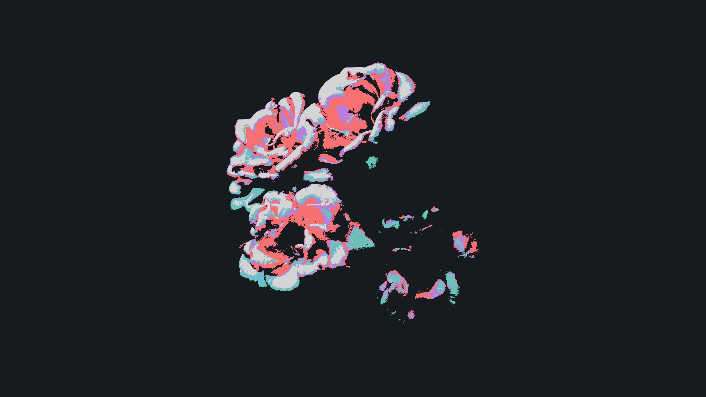
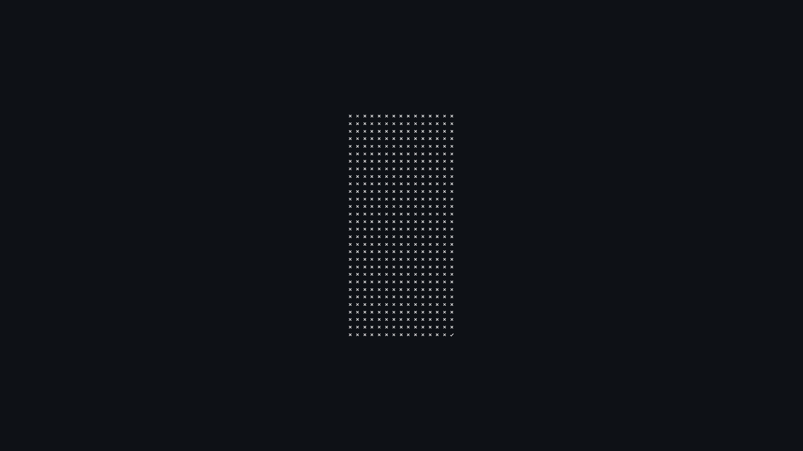

# RADIUM

<a href="maki.png"></a>

<details>

<summary>EXIFTOOL OUTPUT</summary>

```text
ExifTool Version Number         : 12.54
File Name                       : maki.png
Directory                       : .
File Size                       : 151 kB
File Modification Date/Time     : 2023:01:12 17:21:56+05:30
File Access Date/Time           : 2023:04:13 23:49:19+05:30
File Inode Change Date/Time     : 2023:01:12 17:21:56+05:30
File Permissions                : -rw-r--r--
File Type                       : PNG
File Type Extension             : png
MIME Type                       : image/png
Image Width                     : 3840
Image Height                    : 2160
Bit Depth                       : 8
Color Type                      : RGB with Alpha
Compression                     : Deflate/Inflate
Filter                          : Adaptive
Interlace                       : Noninterlaced
Image Size                      : 3840x2160
Megapixels                      : 8.3
```

</details>

<a href="OD_house_night_sat.jpg"></a>

<details>

<summary>EXIFTOOL OUTPUT</summary>

```text
ExifTool Version Number         : 12.54
File Name                       : OD_house_night_sat.jpg
Directory                       : .
File Size                       : 2.3 MB
File Modification Date/Time     : 2023:01:12 17:21:56+05:30
File Access Date/Time           : 2023:04:13 23:49:19+05:30
File Inode Change Date/Time     : 2023:01:12 17:21:56+05:30
File Permissions                : -rw-r--r--
File Type                       : JPEG
File Type Extension             : jpg
MIME Type                       : image/jpeg
JFIF Version                    : 1.01
Exif Byte Order                 : Little-endian (Intel, II)
Orientation                     : Horizontal (normal)
X Resolution                    : 72
Y Resolution                    : 72
Resolution Unit                 : inches
Software                        : GIMP 2.10.32
Modify Date                     : 2022:11:05 00:41:24
Color Space                     : sRGB
Subfile Type                    : Reduced-resolution image
Compression                     : JPEG (old-style)
Photometric Interpretation      : YCbCr
Samples Per Pixel               : 3
Thumbnail Offset                : 316
Thumbnail Length                : 8464
XMP Toolkit                     : XMP Core 4.4.0-Exiv2
Document ID                     : xmp.did:1059A691E6FF11E0BEB7C921C3DE3B42
Instance ID                     : xmp.iid:61412b41-a917-478d-9035-ee8172993ca1
Original Document ID            : uuid:EDA1114CB7E2DE118DAEE57788723415
Format                          : image/jpeg
Api                             : 2.0
Platform                        : Linux
Time Stamp                      : 1667589089065899
Version                         : 2.10.32
Creator Tool                    : GIMP 2.10
Metadata Date                   : 2022:11:05T00:41:24+05:30
History Action                  : saved
History Changed                 : /
History Instance ID             : xmp.iid:b1fb8fb2-c5f7-4614-af32-dca8d292e81b
History Software Agent          : Gimp 2.10 (Linux)
History When                    : 2022:11:05 00:41:29+05:30
Derived From Document ID        : uuid:EDA1114CB7E2DE118DAEE57788723415
Derived From Instance ID        : xmp.iid:D1427DF32FD8E01198B2D4C1BD14A359
Profile CMM Type                : Little CMS
Profile Version                 : 4.3.0
Profile Class                   : Display Device Profile
Color Space Data                : RGB
Profile Connection Space        : XYZ
Profile Date Time               : 2022:11:04 19:10:02
Profile File Signature          : acsp
Primary Platform                : Apple Computer Inc.
CMM Flags                       : Not Embedded, Independent
Device Manufacturer             : 
Device Model                    : 
Device Attributes               : Reflective, Glossy, Positive, Color
Rendering Intent                : Perceptual
Connection Space Illuminant     : 0.9642 1 0.82491
Profile Creator                 : Little CMS
Profile ID                      : 0
Profile Description             : GIMP built-in sRGB
Profile Copyright               : Public Domain
Media White Point               : 0.9642 1 0.82491
Chromatic Adaptation            : 1.04788 0.02292 -0.05022 0.02959 0.99048 -0.01707 -0.00925 0.01508 0.75168
Red Matrix Column               : 0.43604 0.22249 0.01392
Blue Matrix Column              : 0.14305 0.06061 0.71393
Green Matrix Column             : 0.38512 0.7169 0.09706
Red Tone Reproduction Curve     : (Binary data 32 bytes, use -b option to extract)
Green Tone Reproduction Curve   : (Binary data 32 bytes, use -b option to extract)
Blue Tone Reproduction Curve    : (Binary data 32 bytes, use -b option to extract)
Chromaticity Channels           : 3
Chromaticity Colorant           : Unknown
Chromaticity Channel 1          : 0.64 0.33002
Chromaticity Channel 2          : 0.3 0.60001
Chromaticity Channel 3          : 0.15001 0.06
Device Mfg Desc                 : GIMP
Device Model Desc               : sRGB
Image Width                     : 1920
Image Height                    : 1080
Encoding Process                : Progressive DCT, Huffman coding
Bits Per Sample                 : 8
Color Components                : 3
Y Cb Cr Sub Sampling            : YCbCr4:4:4 (1 1)
Image Size                      : 1920x1080
Megapixels                      : 2.1
Thumbnail Image                 : (Binary data 8464 bytes, use -b option to extract)
```

</details>

<a href="output-1659944018.png"></a>

<details>

<summary>EXIFTOOL OUTPUT</summary>

```text
ExifTool Version Number         : 12.54
File Name                       : output-1659944018.png
Directory                       : .
File Size                       : 284 kB
File Modification Date/Time     : 2023:01:12 17:21:56+05:30
File Access Date/Time           : 2023:04:13 23:49:19+05:30
File Inode Change Date/Time     : 2023:01:12 17:21:56+05:30
File Permissions                : -rw-r--r--
File Type                       : PNG
File Type Extension             : png
MIME Type                       : image/png
Image Width                     : 2481
Image Height                    : 1396
Bit Depth                       : 8
Color Type                      : RGB
Compression                     : Deflate/Inflate
Filter                          : Adaptive
Interlace                       : Noninterlaced
Profile Name                    : ICC Profile
Profile CMM Type                : Little CMS
Profile Version                 : 4.3.0
Profile Class                   : Display Device Profile
Color Space Data                : RGB
Profile Connection Space        : XYZ
Profile Date Time               : 2022:08:07 15:41:58
Profile File Signature          : acsp
Primary Platform                : Apple Computer Inc.
CMM Flags                       : Not Embedded, Independent
Device Manufacturer             : 
Device Model                    : 
Device Attributes               : Reflective, Glossy, Positive, Color
Rendering Intent                : Perceptual
Connection Space Illuminant     : 0.9642 1 0.82491
Profile Creator                 : Little CMS
Profile ID                      : 0
Profile Description             : GIMP built-in sRGB
Profile Copyright               : Public Domain
Media White Point               : 0.9642 1 0.82491
Chromatic Adaptation            : 1.04788 0.02292 -0.05022 0.02959 0.99048 -0.01707 -0.00925 0.01508 0.75168
Red Matrix Column               : 0.43604 0.22249 0.01392
Blue Matrix Column              : 0.14305 0.06061 0.71393
Green Matrix Column             : 0.38512 0.7169 0.09706
Red Tone Reproduction Curve     : (Binary data 32 bytes, use -b option to extract)
Green Tone Reproduction Curve   : (Binary data 32 bytes, use -b option to extract)
Blue Tone Reproduction Curve    : (Binary data 32 bytes, use -b option to extract)
Chromaticity Channels           : 3
Chromaticity Colorant           : Unknown
Chromaticity Channel 1          : 0.64 0.33002
Chromaticity Channel 2          : 0.3 0.60001
Chromaticity Channel 3          : 0.15001 0.06
Device Mfg Desc                 : GIMP
Device Model Desc               : sRGB
Exif Byte Order                 : Little-endian (Intel, II)
Orientation                     : Horizontal (normal)
X Resolution                    : 72
Y Resolution                    : 72
Resolution Unit                 : inches
Software                        : GIMP 2.10.32
Modify Date                     : 2022:08:07 21:12:40
Color Space                     : sRGB
Subfile Type                    : Reduced-resolution image
Bits Per Sample                 : 8 8 8
Photometric Interpretation      : YCbCr
Samples Per Pixel               : 3
Thumbnail Offset                : 286
Thumbnail Length                : 3408
Image Size                      : 2481x1396
Megapixels                      : 3.5
Thumbnail Image                 : (Binary data 3408 bytes, use -b option to extract)
```

</details>

<a href="output-1659944023.png"></a>

<details>

<summary>EXIFTOOL OUTPUT</summary>

```text
ExifTool Version Number         : 12.54
File Name                       : output-1659944023.png
Directory                       : .
File Size                       : 343 kB
File Modification Date/Time     : 2023:01:12 17:21:56+05:30
File Access Date/Time           : 2023:04:13 23:49:20+05:30
File Inode Change Date/Time     : 2023:01:12 17:21:56+05:30
File Permissions                : -rw-r--r--
File Type                       : PNG
File Type Extension             : png
MIME Type                       : image/png
Image Width                     : 3876
Image Height                    : 2180
Bit Depth                       : 8
Color Type                      : RGB
Compression                     : Deflate/Inflate
Filter                          : Adaptive
Interlace                       : Noninterlaced
Profile Name                    : ICC Profile
Profile CMM Type                : Little CMS
Profile Version                 : 4.3.0
Profile Class                   : Display Device Profile
Color Space Data                : RGB
Profile Connection Space        : XYZ
Profile Date Time               : 2022:07:13 14:45:11
Profile File Signature          : acsp
Primary Platform                : Apple Computer Inc.
CMM Flags                       : Not Embedded, Independent
Device Manufacturer             : 
Device Model                    : 
Device Attributes               : Reflective, Glossy, Positive, Color
Rendering Intent                : Perceptual
Connection Space Illuminant     : 0.9642 1 0.82491
Profile Creator                 : Little CMS
Profile ID                      : 0
Profile Description             : GIMP built-in sRGB
Profile Copyright               : Public Domain
Media White Point               : 0.9642 1 0.82491
Chromatic Adaptation            : 1.04788 0.02292 -0.05022 0.02959 0.99048 -0.01707 -0.00925 0.01508 0.75168
Red Matrix Column               : 0.43604 0.22249 0.01392
Blue Matrix Column              : 0.14305 0.06061 0.71393
Green Matrix Column             : 0.38512 0.7169 0.09706
Red Tone Reproduction Curve     : (Binary data 32 bytes, use -b option to extract)
Green Tone Reproduction Curve   : (Binary data 32 bytes, use -b option to extract)
Blue Tone Reproduction Curve    : (Binary data 32 bytes, use -b option to extract)
Chromaticity Channels           : 3
Chromaticity Colorant           : Unknown
Chromaticity Channel 1          : 0.64 0.33002
Chromaticity Channel 2          : 0.3 0.60001
Chromaticity Channel 3          : 0.15001 0.06
Device Mfg Desc                 : GIMP
Device Model Desc               : sRGB
Exif Byte Order                 : Little-endian (Intel, II)
Subfile Type                    : Reduced-resolution image
Bits Per Sample                 : 8 8 8
Photometric Interpretation      : YCbCr
Samples Per Pixel               : 3
Thumbnail Offset                : 134
Thumbnail Length                : 3604
Image Size                      : 3876x2180
Megapixels                      : 8.4
Thumbnail Image                 : (Binary data 3604 bytes, use -b option to extract)
```

</details>

<a href="output-1659944035.png"></a>

<details>

<summary>EXIFTOOL OUTPUT</summary>

```text
ExifTool Version Number         : 12.54
File Name                       : output-1659944035.png
Directory                       : .
File Size                       : 972 kB
File Modification Date/Time     : 2023:01:12 17:21:56+05:30
File Access Date/Time           : 2023:04:13 23:49:20+05:30
File Inode Change Date/Time     : 2023:01:12 17:21:56+05:30
File Permissions                : -rw-r--r--
File Type                       : PNG
File Type Extension             : png
MIME Type                       : image/png
Image Width                     : 3876
Image Height                    : 2180
Bit Depth                       : 8
Color Type                      : RGB
Compression                     : Deflate/Inflate
Filter                          : Adaptive
Interlace                       : Noninterlaced
Exif Byte Order                 : Little-endian (Intel, II)
Bits Per Sample                 : 8 8 8
Orientation                     : Horizontal (normal)
X Resolution                    : 72
Y Resolution                    : 72
Resolution Unit                 : inches
Software                        : GIMP 2.10.32
Color Space                     : sRGB
Subfile Type                    : Reduced-resolution image
Photometric Interpretation      : YCbCr
Samples Per Pixel               : 3
Thumbnail Offset                : 328
Thumbnail Length                : 4012
Profile Name                    : ICC profile
Profile CMM Type                : Little CMS
Profile Version                 : 4.3.0
Profile Class                   : Display Device Profile
Color Space Data                : RGB
Profile Connection Space        : XYZ
Profile Date Time               : 2022:08:09 03:54:38
Profile File Signature          : acsp
Primary Platform                : Apple Computer Inc.
CMM Flags                       : Not Embedded, Independent
Device Manufacturer             : 
Device Model                    : 
Device Attributes               : Reflective, Glossy, Positive, Color
Rendering Intent                : Perceptual
Connection Space Illuminant     : 0.9642 1 0.82491
Profile Creator                 : Little CMS
Profile ID                      : 0
Profile Description             : GIMP built-in sRGB
Profile Copyright               : Public Domain
Media White Point               : 0.9642 1 0.82491
Chromatic Adaptation            : 1.04788 0.02292 -0.05022 0.02959 0.99048 -0.01707 -0.00925 0.01508 0.75168
Red Matrix Column               : 0.43604 0.22249 0.01392
Blue Matrix Column              : 0.14305 0.06061 0.71393
Green Matrix Column             : 0.38512 0.7169 0.09706
Red Tone Reproduction Curve     : (Binary data 32 bytes, use -b option to extract)
Green Tone Reproduction Curve   : (Binary data 32 bytes, use -b option to extract)
Blue Tone Reproduction Curve    : (Binary data 32 bytes, use -b option to extract)
Chromaticity Channels           : 3
Chromaticity Colorant           : Unknown
Chromaticity Channel 1          : 0.64 0.33002
Chromaticity Channel 2          : 0.3 0.60001
Chromaticity Channel 3          : 0.15001 0.06
Device Mfg Desc                 : GIMP
Device Model Desc               : sRGB
XMP Toolkit                     : XMP Core 4.4.0-Exiv2
Document ID                     : gimp:docid:gimp:f6f3fccc-05ee-4e35-b0ee-ca9119c197bd
Instance ID                     : xmp.iid:a32a5536-6871-4057-b7e3-440f211ee4d7
Original Document ID            : xmp.did:58465762-6610-4a50-a018-094feba7d2fa
Api                             : 2.0
Platform                        : Linux
Time Stamp                      : 1660017385919571
Version                         : 2.10.32
Format                          : image/png
Creator Tool                    : GIMP 2.10
Metadata Date                   : 2022:08:09T09:26:25+05:30
History Action                  : saved
History Changed                 : /
History Instance ID             : xmp.iid:c7bdd478-a773-48fe-8dfd-9e91c00c45ff
History Software Agent          : Gimp 2.10 (Linux)
History When                    : 2022:08:09 09:26:25+05:30
Background Color                : 255 255 255
Pixels Per Unit X               : 2835
Pixels Per Unit Y               : 2835
Pixel Units                     : meters
Modify Date                     : 2022:08:09 03:56:25
Image Size                      : 3876x2180
Megapixels                      : 8.4
Thumbnail Image                 : (Binary data 4012 bytes, use -b option to extract)
```

</details>

<a href="output-1659958136.png"></a>

<details>

<summary>EXIFTOOL OUTPUT</summary>

```text
ExifTool Version Number         : 12.54
File Name                       : output-1659958136.png
Directory                       : .
File Size                       : 289 kB
File Modification Date/Time     : 2023:01:12 17:21:56+05:30
File Access Date/Time           : 2023:04:13 23:49:20+05:30
File Inode Change Date/Time     : 2023:01:12 17:21:56+05:30
File Permissions                : -rw-r--r--
File Type                       : PNG
File Type Extension             : png
MIME Type                       : image/png
Image Width                     : 3840
Image Height                    : 2160
Bit Depth                       : 8
Color Type                      : RGB
Compression                     : Deflate/Inflate
Filter                          : Adaptive
Interlace                       : Noninterlaced
Exif Byte Order                 : Big-endian (Motorola, MM)
Image Size                      : 3840x2160
Megapixels                      : 8.3
```

</details>

<a href="output-1659958155.png"></a>

<details>

<summary>EXIFTOOL OUTPUT</summary>

```text
ExifTool Version Number         : 12.54
File Name                       : output-1659958155.png
Directory                       : .
File Size                       : 175 kB
File Modification Date/Time     : 2023:01:12 17:21:56+05:30
File Access Date/Time           : 2023:04:13 23:49:20+05:30
File Inode Change Date/Time     : 2023:01:12 17:21:56+05:30
File Permissions                : -rw-r--r--
File Type                       : PNG
File Type Extension             : png
MIME Type                       : image/png
Image Width                     : 3840
Image Height                    : 2160
Bit Depth                       : 8
Color Type                      : RGB
Compression                     : Deflate/Inflate
Filter                          : Adaptive
Interlace                       : Noninterlaced
Profile Name                    : ICC Profile
Profile CMM Type                : 
Profile Version                 : 2.1.0
Profile Class                   : Display Device Profile
Color Space Data                : RGB
Profile Connection Space        : XYZ
Profile Date Time               : 0000:00:00 00:00:00
Profile File Signature          : acsp
Primary Platform                : Unknown ()
CMM Flags                       : Not Embedded, Independent
Device Manufacturer             : 
Device Model                    : 
Device Attributes               : Reflective, Glossy, Positive, Color
Rendering Intent                : Media-Relative Colorimetric
Connection Space Illuminant     : 0.9642 1 0.82491
Profile Creator                 : 
Profile ID                      : 0
Profile Description             : sRGB
Red Matrix Column               : 0.43607 0.22249 0.01392
Green Matrix Column             : 0.38515 0.71687 0.09708
Blue Matrix Column              : 0.14307 0.06061 0.7141
Red Tone Reproduction Curve     : (Binary data 40 bytes, use -b option to extract)
Green Tone Reproduction Curve   : (Binary data 40 bytes, use -b option to extract)
Blue Tone Reproduction Curve    : (Binary data 40 bytes, use -b option to extract)
Media White Point               : 0.9642 1 0.82491
Profile Copyright               : Google Inc. 2016
Image Size                      : 3840x2160
Megapixels                      : 8.3
```

</details>

<a href="output-1659958166.png"></a>

<details>

<summary>EXIFTOOL OUTPUT</summary>

```text
ExifTool Version Number         : 12.54
File Name                       : output-1659958166.png
Directory                       : .
File Size                       : 474 kB
File Modification Date/Time     : 2023:01:12 17:21:56+05:30
File Access Date/Time           : 2023:04:13 23:49:20+05:30
File Inode Change Date/Time     : 2023:01:12 17:21:56+05:30
File Permissions                : -rw-r--r--
File Type                       : PNG
File Type Extension             : png
MIME Type                       : image/png
Image Width                     : 5472
Image Height                    : 3078
Bit Depth                       : 8
Color Type                      : RGB
Compression                     : Deflate/Inflate
Filter                          : Adaptive
Interlace                       : Noninterlaced
Profile Name                    : ICC Profile
Profile CMM Type                : Little CMS
Profile Version                 : 4.3.0
Profile Class                   : Display Device Profile
Color Space Data                : RGB
Profile Connection Space        : XYZ
Profile Date Time               : 2022:02:02 07:39:33
Profile File Signature          : acsp
Primary Platform                : Apple Computer Inc.
CMM Flags                       : Not Embedded, Independent
Device Manufacturer             : 
Device Model                    : 
Device Attributes               : Reflective, Glossy, Positive, Color
Rendering Intent                : Perceptual
Connection Space Illuminant     : 0.9642 1 0.82491
Profile Creator                 : Little CMS
Profile ID                      : 0
Profile Description             : GIMP built-in sRGB
Profile Copyright               : Public Domain
Media White Point               : 0.9642 1 0.82491
Chromatic Adaptation            : 1.04788 0.02292 -0.05022 0.02959 0.99048 -0.01707 -0.00925 0.01508 0.75168
Red Matrix Column               : 0.43604 0.22249 0.01392
Blue Matrix Column              : 0.14305 0.06061 0.71393
Green Matrix Column             : 0.38512 0.7169 0.09706
Red Tone Reproduction Curve     : (Binary data 32 bytes, use -b option to extract)
Green Tone Reproduction Curve   : (Binary data 32 bytes, use -b option to extract)
Blue Tone Reproduction Curve    : (Binary data 32 bytes, use -b option to extract)
Chromaticity Channels           : 3
Chromaticity Colorant           : Unknown
Chromaticity Channel 1          : 0.64 0.33002
Chromaticity Channel 2          : 0.3 0.60001
Chromaticity Channel 3          : 0.15001 0.06
Device Mfg Desc                 : GIMP
Device Model Desc               : sRGB
Exif Byte Order                 : Little-endian (Intel, II)
Orientation                     : Horizontal (normal)
X Resolution                    : 72
Y Resolution                    : 72
Resolution Unit                 : inches
Software                        : GIMP 2.10.30
Modify Date                     : 2022:02:02 13:15:09
Color Space                     : sRGB
Subfile Type                    : Reduced-resolution image
Bits Per Sample                 : 8 8 8
Photometric Interpretation      : YCbCr
Samples Per Pixel               : 3
Thumbnail Offset                : 286
Thumbnail Length                : 2944
Image Size                      : 5472x3078
Megapixels                      : 16.8
Thumbnail Image                 : (Binary data 2944 bytes, use -b option to extract)
```

</details>

<a href="output-1659958593.png"></a>

<details>

<summary>EXIFTOOL OUTPUT</summary>

```text
ExifTool Version Number         : 12.54
File Name                       : output-1659958593.png
Directory                       : .
File Size                       : 235 kB
File Modification Date/Time     : 2023:01:12 17:21:56+05:30
File Access Date/Time           : 2023:04:13 23:49:20+05:30
File Inode Change Date/Time     : 2023:01:12 17:21:56+05:30
File Permissions                : -rw-r--r--
File Type                       : PNG
File Type Extension             : png
MIME Type                       : image/png
Image Width                     : 3840
Image Height                    : 2160
Bit Depth                       : 8
Color Type                      : RGB
Compression                     : Deflate/Inflate
Filter                          : Adaptive
Interlace                       : Noninterlaced
Exif Byte Order                 : Big-endian (Motorola, MM)
Image Size                      : 3840x2160
Megapixels                      : 8.3
```

</details>

<a href="output-1671342628.png"></a>

<details>

<summary>EXIFTOOL OUTPUT</summary>

```text
ExifTool Version Number         : 12.54
File Name                       : output-1671342628.png
Directory                       : .
File Size                       : 901 bytes
File Modification Date/Time     : 2023:01:12 17:21:56+05:30
File Access Date/Time           : 2023:04:13 23:49:20+05:30
File Inode Change Date/Time     : 2023:01:12 17:21:56+05:30
File Permissions                : -rw-r--r--
File Type                       : PNG
File Type Extension             : png
MIME Type                       : image/png
Image Width                     : 160
Image Height                    : 160
Bit Depth                       : 8
Color Type                      : RGB with Alpha
Compression                     : Deflate/Inflate
Filter                          : Adaptive
Interlace                       : Noninterlaced
Image Size                      : 160x160
Megapixels                      : 0.026
```

</details>

<a href="output-1671342884.png"></a>

<details>

<summary>EXIFTOOL OUTPUT</summary>

```text
ExifTool Version Number         : 12.54
File Name                       : output-1671342884.png
Directory                       : .
File Size                       : 1424 bytes
File Modification Date/Time     : 2023:01:12 17:21:56+05:30
File Access Date/Time           : 2023:04:13 23:49:20+05:30
File Inode Change Date/Time     : 2023:01:12 17:21:56+05:30
File Permissions                : -rw-r--r--
File Type                       : PNG
File Type Extension             : png
MIME Type                       : image/png
Image Width                     : 160
Image Height                    : 160
Bit Depth                       : 8
Color Type                      : RGB with Alpha
Compression                     : Deflate/Inflate
Filter                          : Adaptive
Interlace                       : Noninterlaced
Profile Name                    : ICC Profile
Profile CMM Type                : Little CMS
Profile Version                 : 4.3.0
Profile Class                   : Display Device Profile
Color Space Data                : RGB
Profile Connection Space        : XYZ
Profile Date Time               : 2021:11:16 11:14:27
Profile File Signature          : acsp
Primary Platform                : Apple Computer Inc.
CMM Flags                       : Not Embedded, Independent
Device Manufacturer             : 
Device Model                    : 
Device Attributes               : Reflective, Glossy, Positive, Color
Rendering Intent                : Perceptual
Connection Space Illuminant     : 0.9642 1 0.82491
Profile Creator                 : Little CMS
Profile ID                      : 0
Profile Description             : GIMP built-in sRGB
Profile Copyright               : Public Domain
Media White Point               : 0.9642 1 0.82491
Chromatic Adaptation            : 1.04788 0.02292 -0.05022 0.02959 0.99048 -0.01707 -0.00925 0.01508 0.75168
Red Matrix Column               : 0.43604 0.22249 0.01392
Blue Matrix Column              : 0.14305 0.06061 0.71393
Green Matrix Column             : 0.38512 0.7169 0.09706
Red Tone Reproduction Curve     : (Binary data 32 bytes, use -b option to extract)
Green Tone Reproduction Curve   : (Binary data 32 bytes, use -b option to extract)
Blue Tone Reproduction Curve    : (Binary data 32 bytes, use -b option to extract)
Chromaticity Channels           : 3
Chromaticity Colorant           : Unknown
Chromaticity Channel 1          : 0.64 0.33002
Chromaticity Channel 2          : 0.3 0.60001
Chromaticity Channel 3          : 0.15001 0.06
Device Mfg Desc                 : GIMP
Device Model Desc               : sRGB
Image Size                      : 160x160
Megapixels                      : 0.026
```

</details>

<a href="output-1671905268.png"></a>

<details>

<summary>EXIFTOOL OUTPUT</summary>

```text
ExifTool Version Number         : 12.54
File Name                       : output-1671905268.png
Directory                       : .
File Size                       : 482 kB
File Modification Date/Time     : 2023:01:12 17:21:56+05:30
File Access Date/Time           : 2023:04:13 23:49:20+05:30
File Inode Change Date/Time     : 2023:01:12 17:21:56+05:30
File Permissions                : -rw-r--r--
File Type                       : PNG
File Type Extension             : png
MIME Type                       : image/png
Image Width                     : 3840
Image Height                    : 2160
Bit Depth                       : 8
Color Type                      : RGB
Compression                     : Deflate/Inflate
Filter                          : Adaptive
Interlace                       : Noninterlaced
Profile Name                    : ICC Profile
Profile CMM Type                : Little CMS
Profile Version                 : 4.3.0
Profile Class                   : Display Device Profile
Color Space Data                : RGB
Profile Connection Space        : XYZ
Profile Date Time               : 2020:12:07 16:53:58
Profile File Signature          : acsp
Primary Platform                : Apple Computer Inc.
CMM Flags                       : Not Embedded, Independent
Device Manufacturer             : 
Device Model                    : 
Device Attributes               : Reflective, Glossy, Positive, Color
Rendering Intent                : Perceptual
Connection Space Illuminant     : 0.9642 1 0.82491
Profile Creator                 : Little CMS
Profile ID                      : 0
Profile Description             : GIMP built-in sRGB
Profile Copyright               : Public Domain
Media White Point               : 0.9642 1 0.82491
Chromatic Adaptation            : 1.04788 0.02292 -0.05022 0.02959 0.99048 -0.01707 -0.00925 0.01508 0.75168
Red Matrix Column               : 0.43604 0.22249 0.01392
Blue Matrix Column              : 0.14305 0.06061 0.71393
Green Matrix Column             : 0.38512 0.7169 0.09706
Red Tone Reproduction Curve     : (Binary data 32 bytes, use -b option to extract)
Green Tone Reproduction Curve   : (Binary data 32 bytes, use -b option to extract)
Blue Tone Reproduction Curve    : (Binary data 32 bytes, use -b option to extract)
Chromaticity Channels           : 3
Chromaticity Colorant           : Unknown
Chromaticity Channel 1          : 0.64 0.33002
Chromaticity Channel 2          : 0.3 0.60001
Chromaticity Channel 3          : 0.15001 0.06
Device Mfg Desc                 : GIMP
Device Model Desc               : sRGB
Image Size                      : 3840x2160
Megapixels                      : 8.3
```

</details>

<a href="output-1671905959.png"></a>

<details>

<summary>EXIFTOOL OUTPUT</summary>

```text
ExifTool Version Number         : 12.54
File Name                       : output-1671905959.png
Directory                       : .
File Size                       : 54 kB
File Modification Date/Time     : 2023:01:12 17:21:56+05:30
File Access Date/Time           : 2023:04:13 23:49:21+05:30
File Inode Change Date/Time     : 2023:01:12 17:21:56+05:30
File Permissions                : -rw-r--r--
File Type                       : PNG
File Type Extension             : png
MIME Type                       : image/png
Image Width                     : 4330
Image Height                    : 2436
Bit Depth                       : 8
Color Type                      : RGB
Compression                     : Deflate/Inflate
Filter                          : Adaptive
Interlace                       : Noninterlaced
Profile Name                    : ICC Profile
Profile CMM Type                : Apple Computer Inc.
Profile Version                 : 4.0.0
Profile Class                   : Display Device Profile
Color Space Data                : RGB
Profile Connection Space        : XYZ
Profile Date Time               : 2017:07:07 13:22:32
Profile File Signature          : acsp
Primary Platform                : Apple Computer Inc.
CMM Flags                       : Not Embedded, Independent
Device Manufacturer             : Apple Computer Inc.
Device Model                    : 
Device Attributes               : Reflective, Glossy, Positive, Color
Rendering Intent                : Perceptual
Connection Space Illuminant     : 0.9642 1 0.82491
Profile Creator                 : Apple Computer Inc.
Profile ID                      : ca1a9582257f104d389913d5d1ea1582
Profile Description             : Display P3
Profile Copyright               : Copyright Apple Inc., 2017
Media White Point               : 0.95045 1 1.08905
Red Matrix Column               : 0.51512 0.2412 -0.00105
Green Matrix Column             : 0.29198 0.69225 0.04189
Blue Matrix Column              : 0.1571 0.06657 0.78407
Red Tone Reproduction Curve     : (Binary data 32 bytes, use -b option to extract)
Chromatic Adaptation            : 1.04788 0.02292 -0.0502 0.02959 0.99048 -0.01706 -0.00923 0.01508 0.75168
Blue Tone Reproduction Curve    : (Binary data 32 bytes, use -b option to extract)
Green Tone Reproduction Curve   : (Binary data 32 bytes, use -b option to extract)
Exif Byte Order                 : Big-endian (Motorola, MM)
Exif Image Width                : 4330
Exif Image Height               : 2436
Image Size                      : 4330x2436
Megapixels                      : 10.5
```

</details>

<a href="output-1671906013.png"></a>

<details>

<summary>EXIFTOOL OUTPUT</summary>

```text
ExifTool Version Number         : 12.54
File Name                       : output-1671906013.png
Directory                       : .
File Size                       : 54 kB
File Modification Date/Time     : 2023:01:12 17:21:56+05:30
File Access Date/Time           : 2023:04:13 23:49:21+05:30
File Inode Change Date/Time     : 2023:01:12 17:21:56+05:30
File Permissions                : -rw-r--r--
File Type                       : PNG
File Type Extension             : png
MIME Type                       : image/png
Image Width                     : 4330
Image Height                    : 2436
Bit Depth                       : 8
Color Type                      : RGB
Compression                     : Deflate/Inflate
Filter                          : Adaptive
Interlace                       : Noninterlaced
Profile Name                    : ICC Profile
Profile CMM Type                : Apple Computer Inc.
Profile Version                 : 4.0.0
Profile Class                   : Display Device Profile
Color Space Data                : RGB
Profile Connection Space        : XYZ
Profile Date Time               : 2017:07:07 13:22:32
Profile File Signature          : acsp
Primary Platform                : Apple Computer Inc.
CMM Flags                       : Not Embedded, Independent
Device Manufacturer             : Apple Computer Inc.
Device Model                    : 
Device Attributes               : Reflective, Glossy, Positive, Color
Rendering Intent                : Perceptual
Connection Space Illuminant     : 0.9642 1 0.82491
Profile Creator                 : Apple Computer Inc.
Profile ID                      : ca1a9582257f104d389913d5d1ea1582
Profile Description             : Display P3
Profile Copyright               : Copyright Apple Inc., 2017
Media White Point               : 0.95045 1 1.08905
Red Matrix Column               : 0.51512 0.2412 -0.00105
Green Matrix Column             : 0.29198 0.69225 0.04189
Blue Matrix Column              : 0.1571 0.06657 0.78407
Red Tone Reproduction Curve     : (Binary data 32 bytes, use -b option to extract)
Chromatic Adaptation            : 1.04788 0.02292 -0.0502 0.02959 0.99048 -0.01706 -0.00923 0.01508 0.75168
Blue Tone Reproduction Curve    : (Binary data 32 bytes, use -b option to extract)
Green Tone Reproduction Curve   : (Binary data 32 bytes, use -b option to extract)
Exif Byte Order                 : Big-endian (Motorola, MM)
Exif Image Width                : 4330
Exif Image Height               : 2436
Image Size                      : 4330x2436
Megapixels                      : 10.5
```

</details>

<a href="pacman.png"></a>

<details>

<summary>EXIFTOOL OUTPUT</summary>

```text
ExifTool Version Number         : 12.54
File Name                       : pacman.png
Directory                       : .
File Size                       : 69 kB
File Modification Date/Time     : 2023:01:12 17:21:56+05:30
File Access Date/Time           : 2023:04:13 23:49:21+05:30
File Inode Change Date/Time     : 2023:01:12 17:21:56+05:30
File Permissions                : -rw-r--r--
File Type                       : PNG
File Type Extension             : png
MIME Type                       : image/png
Image Width                     : 5006
Image Height                    : 2816
Bit Depth                       : 8
Color Type                      : RGB with Alpha
Compression                     : Deflate/Inflate
Filter                          : Adaptive
Interlace                       : Noninterlaced
Exif Byte Order                 : Little-endian (Intel, II)
Bits Per Sample                 : 8 8 8
Orientation                     : Horizontal (normal)
X Resolution                    : 28.35
Y Resolution                    : 28.35
Resolution Unit                 : cm
Software                        : GIMP 2.10.32
Color Space                     : sRGB
Subfile Type                    : Reduced-resolution image
Photometric Interpretation      : YCbCr
Samples Per Pixel               : 3
Thumbnail Offset                : 328
Thumbnail Length                : 1987
Profile Name                    : ICC profile
Profile CMM Type                : Little CMS
Profile Version                 : 4.3.0
Profile Class                   : Display Device Profile
Color Space Data                : RGB
Profile Connection Space        : XYZ
Profile Date Time               : 2022:08:11 04:57:08
Profile File Signature          : acsp
Primary Platform                : Apple Computer Inc.
CMM Flags                       : Not Embedded, Independent
Device Manufacturer             : 
Device Model                    : 
Device Attributes               : Reflective, Glossy, Positive, Color
Rendering Intent                : Perceptual
Connection Space Illuminant     : 0.9642 1 0.82491
Profile Creator                 : Little CMS
Profile ID                      : 0
Profile Description             : GIMP built-in sRGB
Profile Copyright               : Public Domain
Media White Point               : 0.9642 1 0.82491
Chromatic Adaptation            : 1.04788 0.02292 -0.05022 0.02959 0.99048 -0.01707 -0.00925 0.01508 0.75168
Red Matrix Column               : 0.43604 0.22249 0.01392
Blue Matrix Column              : 0.14305 0.06061 0.71393
Green Matrix Column             : 0.38512 0.7169 0.09706
Red Tone Reproduction Curve     : (Binary data 32 bytes, use -b option to extract)
Green Tone Reproduction Curve   : (Binary data 32 bytes, use -b option to extract)
Blue Tone Reproduction Curve    : (Binary data 32 bytes, use -b option to extract)
Chromaticity Channels           : 3
Chromaticity Colorant           : Unknown
Chromaticity Channel 1          : 0.64 0.33002
Chromaticity Channel 2          : 0.3 0.60001
Chromaticity Channel 3          : 0.15001 0.06
Device Mfg Desc                 : GIMP
Device Model Desc               : sRGB
XMP Toolkit                     : XMP Core 4.4.0-Exiv2
Document ID                     : gimp:docid:gimp:4c91d8f9-3f85-4dbf-8072-1634885e8cb6
Instance ID                     : xmp.iid:b154622d-bb6a-4155-8658-1a155d48d6e4
Original Document ID            : xmp.did:39acdec8-4815-4e78-92e0-044ac814ded6
Api                             : 2.0
Platform                        : Linux
Time Stamp                      : 1660193889615310
Version                         : 2.10.32
Format                          : image/png
Creator Tool                    : GIMP 2.10
Metadata Date                   : 2022:08:11T10:28:08+05:30
History Action                  : saved, saved
History Changed                 : /, /
History Instance ID             : xmp.iid:38ce9c6b-671a-486c-9a0b-1cbc1572b20b, xmp.iid:7497de6c-d5e4-4ce1-bf94-631b45228488
History Software Agent          : Gimp 2.10 (Linux), Gimp 2.10 (Linux)
History When                    : 2022:08:10 10:11:55+05:30, 2022:08:11 10:28:09+05:30
Background Color                : 255 255 255
Pixels Per Unit X               : 2835
Pixels Per Unit Y               : 2835
Pixel Units                     : meters
Modify Date                     : 2022:08:11 04:58:08
Image Size                      : 5006x2816
Megapixels                      : 14.1
Thumbnail Image                 : (Binary data 1987 bytes, use -b option to extract)
```

</details>

<a href="radium.jpg"></a>

<details>

<summary>EXIFTOOL OUTPUT</summary>

```text
ExifTool Version Number         : 12.54
File Name                       : radium.jpg
Directory                       : .
File Size                       : 167 kB
File Modification Date/Time     : 2023:01:12 17:21:56+05:30
File Access Date/Time           : 2023:04:13 23:49:21+05:30
File Inode Change Date/Time     : 2023:01:12 17:21:56+05:30
File Permissions                : -rw-r--r--
File Type                       : JPEG
File Type Extension             : jpg
MIME Type                       : image/jpeg
JFIF Version                    : 1.01
Exif Byte Order                 : Little-endian (Intel, II)
Orientation                     : Horizontal (normal)
X Resolution                    : 28.35
Y Resolution                    : 28.35
Resolution Unit                 : cm
Software                        : GIMP 2.10.30
Modify Date                     : 2022:05:08 02:01:11
Color Space                     : sRGB
Subfile Type                    : Reduced-resolution image
Compression                     : JPEG (old-style)
Photometric Interpretation      : YCbCr
Samples Per Pixel               : 3
Thumbnail Offset                : 316
Thumbnail Length                : 1880
XMP Toolkit                     : XMP Core 4.4.0-Exiv2
Document ID                     : gimp:docid:gimp:7b241794-0399-4585-a649-09819946a600
Instance ID                     : xmp.iid:e797a004-d1e2-47b9-8eba-e2374c90de3f
Original Document ID            : xmp.did:fc53df78-bd2e-4c25-8bda-34e8f064714a
Api                             : 2.0
Platform                        : Linux
Time Stamp                      : 1651955473052090
Version                         : 2.10.30
Format                          : image/jpeg
Creator Tool                    : GIMP 2.10
History Action                  : saved, saved, saved
History Changed                 : /, /, /
History Instance ID             : xmp.iid:ae3c6ea7-e325-4cd0-be11-e361d84bcb60, xmp.iid:cfcfe997-4590-4477-b34d-5aee4e382a9a, xmp.iid:2c62e72d-1a8c-45c7-8344-123e8da825a4
History Software Agent          : Gimp 2.10 (Linux), Gimp 2.10 (Linux), Gimp 2.10 (Linux)
History When                    : 2022:05:06 01:52:36+05:30, 2022:05:07 21:48:26+05:30, 2022:05:08 02:01:13+05:30
Profile CMM Type                : Little CMS
Profile Version                 : 4.3.0
Profile Class                   : Display Device Profile
Color Space Data                : RGB
Profile Connection Space        : XYZ
Profile Date Time               : 2022:05:07 20:30:50
Profile File Signature          : acsp
Primary Platform                : Apple Computer Inc.
CMM Flags                       : Not Embedded, Independent
Device Manufacturer             : 
Device Model                    : 
Device Attributes               : Reflective, Glossy, Positive, Color
Rendering Intent                : Perceptual
Connection Space Illuminant     : 0.9642 1 0.82491
Profile Creator                 : Little CMS
Profile ID                      : 0
Profile Description             : GIMP built-in sRGB
Profile Copyright               : Public Domain
Media White Point               : 0.9642 1 0.82491
Chromatic Adaptation            : 1.04788 0.02292 -0.05022 0.02959 0.99048 -0.01707 -0.00925 0.01508 0.75168
Red Matrix Column               : 0.43604 0.22249 0.01392
Blue Matrix Column              : 0.14305 0.06061 0.71393
Green Matrix Column             : 0.38512 0.7169 0.09706
Red Tone Reproduction Curve     : (Binary data 32 bytes, use -b option to extract)
Green Tone Reproduction Curve   : (Binary data 32 bytes, use -b option to extract)
Blue Tone Reproduction Curve    : (Binary data 32 bytes, use -b option to extract)
Chromaticity Channels           : 3
Chromaticity Colorant           : Unknown
Chromaticity Channel 1          : 0.64 0.33002
Chromaticity Channel 2          : 0.3 0.60001
Chromaticity Channel 3          : 0.15001 0.06
Device Mfg Desc                 : GIMP
Device Model Desc               : sRGB
Image Width                     : 4261
Image Height                    : 2245
Encoding Process                : Progressive DCT, Huffman coding
Bits Per Sample                 : 8
Color Components                : 3
Y Cb Cr Sub Sampling            : YCbCr4:4:4 (1 1)
Image Size                      : 4261x2245
Megapixels                      : 9.6
Thumbnail Image                 : (Binary data 1880 bytes, use -b option to extract)
```

</details>
